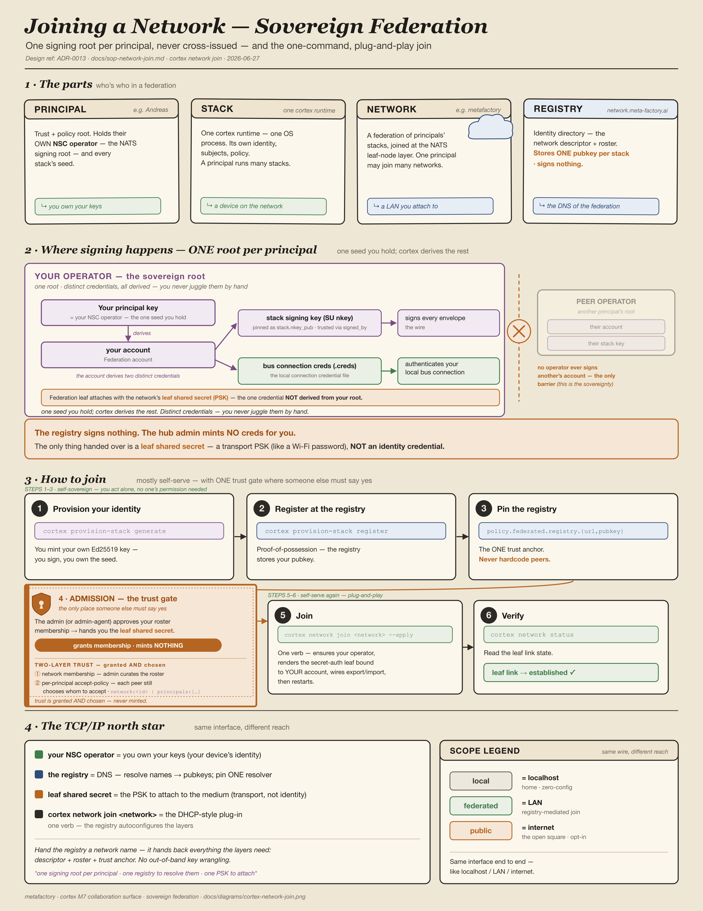

# Cortex — Context

Cortex is the M7 collaboration surface of the metafactory Myelin layer model: it consumes the bus, runs agents, dispatches work, and presents activity to the principal through Mission Control and chat adapters.

This is the canonical domain glossary for the **cortex** bounded context — one canonical term per concept; aliases are listed under _Avoid_. Boundary terms shared with soma, myelin, and signal are reconciled in `compass/ecosystem/CONTEXT-MAP.md`. Resolved by a `grill-with-docs` session (Q1–Q14).

## Language

### Principals, stacks, networks

**Principal**:
The human who owns and runs Cortex stacks — root of the trust and policy model, and the identity that scopes every subject the principal's stacks emit. One principal runs one or more **stacks** (e.g. `andreas` runs `andreas/meta-factory`, `andreas/work`, `andreas/halden`).
_Avoid_: operator, user, owner, human, org

**Stack**:
One running cortex deployment under a **principal** — its own `cortex.yaml`, signing identity, subject sub-namespace, and JetStream consumers. A principal runs one or more stacks side by side, purpose-named. The second subject segment: `local.{principal}.{stack}.…`.
_Avoid_: deployment, instance, node. Never use `stack` for the M1–M7 architecture — that is the **Myelin layer model**.

**Stack slug**:
The trailing segment of `stack.id` (`{principal}/{slug}` → `slug`; e.g. `andreas/community` → `community`). **`stack.id` is the single authority for the slug** — the federation subject segment (`local`/`federated.{principal}.{slug}.…`, the canonical DID `did:mf:{principal}-{slug}` per [compass `sops/federation-wire-protocol.md`](https://github.com/the-metafactory/compass/blob/main/sops/federation-wire-protocol.md) §3 + `docs/adr/0001`) and the launchd/systemd label (`ai.meta-factory.cortex.{slug}`) derive from it. The `cortex network join` **write path** targets the file the daemon composes `policy:` from — resolved from the daemon's `--config` locator, not a `stack.id`-derived path — which **converges with `stack.id` under the alignment invariant** (locator == slug) but follows the daemon's actual config on a drifted stack so the write stays effective (no split-brain; refs `docs/adr/0004` DA-5, #805/#807/#813). The config **file/dir name** is a cosmetic *locator* the lifecycle scripts use to find the config; it **MUST equal** the stack.id slug, but it is not the authority. The legacy `cortex.yaml → meta-factory` filename mapping is a single-file convenience, not an authority. When the locator and `stack.id` disagree the stack is **drifted** — it federates as one identity but is labelled another (see _Flagged ambiguities_); `arc upgrade` warns on drift (`warn_stack_identity_drift`), and reconciliation is a principal rename of the dir/file onto `stack.id`, not an automatic rewrite. Decision recorded in `docs/adr/0004-stack-slug-authority.md`.
_Avoid_: treating the filename/dirname/plist label as the source of truth; "config name" as identity.

**Discord App**:
The Discord-side bot identity a **stack** authenticates with — a *Discord object* (its token is the stack's Discord credential), **not** a cortex concept and distinct in *kind* from a **principal** (a human) and a **stack slug** (a deployment label). **One App per stack instance**, reused across guilds — the C-704 `guildId` filter isolates each stack — so one App serves N guilds and you create a second only for a genuinely separate stack. Name it after the assistant/stack, never after a server. The App/principal/slug conflation is the most common onboarding stumble; the contrasting primer lives in [`docs/sop-onboard-peer-principal.md`](docs/sop-onboard-peer-principal.md#core-concepts-app-vs-principal-vs-slug).
_Avoid_: bot (ambiguous with the cortex **agent**), token, integration.

**Cortex runtime**:
The OS process that hosts a **principal**'s **stacks** — a single runtime runs one or more stacks side by side, each keeping its OWN signing identity (M3), subject sub-namespace (M4), policy (M6) and NatsLinks (one per **network** a stack joins, M1). The runtime is *process packaging, not a layer*: consolidating stacks into one process MUST preserve each stack's layer isolation — no cross-stack identity / subject / policy leakage (enforced by subject-segment isolation). Replaces the earlier one-process-per-stack model (cortex#117): a principal's stacks live in one runtime, cutting process sprawl, without merging their layers.
_Avoid_: daemon (the per-assistant runtime identity is the **agent**), server, host, node.

**Network**:
A federation of **principals** whose **stacks** interconnect at the NATS leaf-node layer — `metafactory` is the network this ecosystem runs on. A network is **not a subject segment**: it is deployment topology. Cross-principal reach is the `federated.` **scope** prefix, never a network name on the wire. A principal may belong to more than one network.

A stack **joins** a network through the **network-join control plane** — `cortex network join <network>` (`docs/sop-network-join.md`, spec `docs/design-network-join-control-plane.md`, binding decisions `docs/adr/0003-network-join-control-plane.md`). The control plane is additive over the unchanged L1–L7 data plane: the **registry** (`network.meta-factory.ai`) is the source of truth for the network descriptor (`hub_url`/`leaf_port`) + peer roster; cortex pins + verifies the registry (DD-9), resolves peers from the roster (DD-5), and renders the leaf link from the descriptor (DD-12). Joining is one command, not the ~10 manual steps it replaces. Hand-pinning a peer pubkey survives as the offline fallback only.

**Federation is the default for multi-principal collaboration**, not the exception. When two principals' bots interact (e.g. Andreas's assistant replies to a message JC's user posted), the dispatch envelope MUST publish on `federated.{principal}.{stack}.…` — `local.` never crosses the principal boundary. This is the OSI/L3 routing equivalent: `local.` is one broadcast domain, `federated.` is cross-network routing. A shared platform channel (Discord, Mattermost, Slack) does NOT make cross-principal traffic intra-principal — the surface is L7; the routing happens at L1–L3 on the bus.
_Avoid_: federation (that is the relationship, not the thing), mesh, fabric, org, cluster

### Assistants & agents

**Assistant**:
The named being cortex runs — Luna, Echo, Forge, Pilot. Has a persona, a voice, and continuity of identity. An assistant is hosted by an **agent**. The assistant name is what the bus routes to: the `@{assistant}` segment in Direct/Delegate **dispatch** (`@forge`, `@pilot`).
_Avoid_: persona, bot, DA, character

**Agent**:
The stack-local, long-lived runtime identity (daemon) that hosts an **assistant** on the bus — its own NKey signing identity and a JetStream consumer. An agent has **no independent name**: it is reached via the **assistant** it hosts plus the **stack** it runs on. The same assistant may be hosted by different agents on different stacks ("same assistant, different agent surfaces"). An agent **runs sessions** (it is not itself a session); distinct from the **substrate's** own word "agent" — a Claude Code `Agent`-tool spawn is a **child session**, not a cortex agent (that is a substrate label).
_Avoid_: bot, persona, daemon (as the domain term); a **session** or **child session** (Claude Code's bare "agent"/"sub-agent" are substrate labels, not the bus-identity agent)

**Sub-agent** (substrate-projection term):
What the **Claude Code** substrate calls a **child session** spawned via its `Agent`/`Task` tool — e.g. the Engineer or Explore sub-agents the pilot loop uses. **A substrate label, not a domain entity:** the substrate-agnostic term is **child session** (a **session** with a `parent_session_id`); Codex projects a different word for the same row. Mission Control's model + schema speak **session** / **child session**; "sub-agent" survives only as the display label rendered through the Claude-Code lens. Not an **agent**: no bus identity, no persistence. Always carries the `sub-` qualifier; never bare `agent`.
_Avoid_: agent (bare), worker, helper; "sub-agent" in the MC domain model or schema (say **child session**)

**Agent presence**:
Whether an **agent** process is up and consuming the bus — *independent of any dispatch*. Carried on the **`agent` domain** (`agent.{online|heartbeat|offline|capabilities-changed}`, G-1114), with a liveness FSM (online while heartbeats arrive within TTL → offline on graceful `offline` or TTL lapse). An idle agent has presence; it is not running a dispatch. Presence is what the Mission Control **Network view** renders across stacks. **Cross-principal, only presence + dispatch *lifecycle* metadata is visible** — never the **session interior** (ADR-0005): clicking a peer's agent shows identity, online state, capabilities, and any federated `dispatch.task.*` lifecycle, but never their tool calls/prompts/diffs (those never leave the peer's stack). Supersedes the observability-only `agents.capabilities.registered` envelope (folded into `agent.online` + `agent.capabilities-changed`; dual-emit then retire — routing is unaffected, it is subject/consumer-filter based, not registry-lookup based). (Resolved 2026-06-10, G-1114 grilling.)
_Avoid_: liveness (that is the FSM, not the concept), availability; conflating presence with dispatch progress (`system.agent.heartbeat`)

### Sessions

**Session**:
One run of a **substrate** — a single `claude-code`/`codex`/… execution with its own id (`cc_session_id`), lifecycle, and **session interior**. A session belongs to one **agent** and runs on one **substrate** (an attribute, not a separate hierarchy level). It is the unit Mission Control's working view renders. A session is either **agent-rooted** (started directly by its agent — no parent session) or a **child session** initiated by another session (see **Session tree**). The substrate-neutral term — soma's framing: *"Soma's living existence inside a session of a substrate."* (Resolved 2026-06-11, MC session-tree grilling.)
_Avoid_: agent (a session is **not** an agent — that conflation is the bug the MC session-tree refactor fixes), run, instance (bare), thread (a platform word)

**Session tree** (parent / child session):
The recursive structure of an **agent**'s work: a **session** may spawn **child sessions**, each of which may spawn its own — a tree rooted at the agent. The edge is **initiated-by**: a child session carries a `parent_session_id` naming the session that spawned it; an agent-rooted session has none. A child session is structurally *agent-like* — it runs its own session and can spawn further children — but is **not an agent**: no bus identity, no persistence; it is identified with its session. What **Claude Code** calls a **sub-agent** is exactly a child session on the `claude-code` substrate (a substrate-projection label — see **Sub-agent**). (Resolved 2026-06-11.)
_Avoid_: sub-agent tree (substrate term — say child session), delegation tree (the bus-layer concern an agent owns locally), modelling a child session as its own **agent** row

### The bus

**Subject**:
The dotted NATS routing string a message is published to or subscribed on — `{scope}.{principal}.{stack}.{domain}.{entity}.{action}`. Routing lives in the subject, not in code. Subscribers match with NATS wildcards (`*`, `>`).
_Avoid_: topic (the Kafka/MQTT word — NATS subjects have different semantics), channel, path

**Scope**:
How far a **subject** may travel, set by its prefix — exactly three values: `local` (never leaves the **principal** boundary), `federated` (crosses to peer principals in a **network**), `public` (unrestricted; carries no principal/stack segment).

The three scopes are also the three **onboarding tiers** of the network-join control plane (`docs/adr/0003-network-join-control-plane.md`, `docs/sop-network-join.md`): **local** is zero-config (the home bus — nothing to join); **federated** is the registry-mediated `cortex network join <network>` (the registry resolves hub + roster + peer pubkeys); **public** is the opt-in open square — the Internet of Agentic Work. The same wire grammar governs all three; only the scope prefix and the gate's trust source differ. The security posture (`signing: off → permissive → enforce`) is orthogonal to scope — joining a tier never changes your signing posture.
_Avoid_: reach, visibility, tier, level (when naming the prefix; "onboarding tier" is fine for the join model)

**Domain**:
The functional-domain segment of a **subject** — groups related signals. Values: `tasks`, `agent`, `system`, `code`, `review`, `dispatch`, `governance`, `brain`. Always the segment ("the tasks domain"). The `tasks` and `dispatch` domains are distinct and coexist: **`tasks.{capability}.{subcapability}`** is the work-request namespace (where Offer-mode work is published, capability-routed); **`dispatch.task.{action}`** is the task-lifecycle namespace (events about an active dispatch — `received`, `dispatched`, `started`, `completed`, `failed`, `aborted`). Not a rename in flight.

The **`brain` domain** (`brain.{capability}`, cortex#1021 B-3) is the **inbound-to-exec-brain work namespace**: a surface @-mention of a bot-pack (exec-brain) agent is published here for the agent's own `BrainConsumer` to pull and compose against. It is deliberately a SEPARATE domain from `tasks.`, not `tasks.@{assistant}.{capability}`: a brain needs its OWN JetStream stream (`BRAIN_TASKS`, owning `…brain.>`) so its durable receives non-code-review capabilities (B-1 bound every brain capability on CODE_REVIEW, whose filter is `tasks.code-review.>` — so the durable was created but never delivered). A generic brain stream cannot live under `tasks.` without colliding: `tasks.*.>` overlaps `tasks.code-review.>`, and JetStream rejects overlapping subjects across streams. `brain.` is a disjoint segment-4 token, so `BRAIN_TASKS` partitions cleanly against CODE_REVIEW / DEV_IMPLEMENT / REVIEW_LIFECYCLE. A brain's OWN outbound fleet `dispatch` effects still use `tasks.{capability}` (targeting the review/dev consumers) — only inbound-to-brain work is the `brain` domain. **Brain-task payload contract** (`buildBrainTaskPayload`): `{ text, scenario, user, response_routing, attachments? }`. `text`/`scenario` both carry the message so either brain reader works; `response_routing` is the standard reply-routing block (above). `attachments?` is an OPTIONAL array of inbound file-attachment **references** — `{ name, contentType?, url }`, the URL not the bytes — present only when the @-mention carried uploads. cortex forwards only origin-validated refs (`safeAttachmentRefs`: https + per-surface CDN host allowlist + default port, fail-closed). A brain MAY fetch the URL to consume the file; that consuming behavior lives in the brain, not this contract (the SOC `A_INGEST_ATTACHMENT` block is pulse #61, separate repo). Additive/back-compatible: absent for file-less messages and for surfaces that don't yet populate attachment refs (Discord does; Mattermost is a follow-up).

The **`agent` domain** carries **agent presence** — `agent.{online|heartbeat|offline|capabilities-changed}` (G-1114, the cross-stack topology view): "this agent process is up and consuming, idle or not." It is **distinct from `system.agent.heartbeat`** (cortex#361), which is **dispatch-scoped** liveness — fired only *while a dispatch is in flight*, keyed by `correlation_id` ("this task is still progressing"). Two differently-scoped heartbeats by design: `agent.heartbeat` answers *is this agent alive*, `system.agent.heartbeat` answers *is this task progressing*. An idle agent emits the former, never the latter. (Resolved 2026-06-10, G-1114 grilling.)
_Avoid_: channel, category — and never use `domain` for the DDD bounded-context sense (that is always written **bounded context**); never read `system.agent.heartbeat` as an agent-presence signal (it is dispatch liveness).

**Envelope**:
The signed wrapper that travels on a **subject** — metadata (`sovereignty`, `signed_by[]`, `correlation_id`, `source`, `type`) around a **payload**. Every bus message is an envelope.
_Avoid_: message (too loose — say envelope for the wrapper, payload for the content), packet

**Payload**:
The inner content body of an **envelope** — the domain data, distinct from the envelope's routing/trust metadata.
_Avoid_: message, body, data

**Capability**:
A declared, bus-routable ability — e.g. `code-review.typescript`, `chat`, `release`, `security-scan`. An **assistant** declares the capabilities it offers; the `tasks.{capability}.{subcapability}` **subject** routes on it (for Offer mode); for Direct/Delegate mode the capability appears as the trailing segment after `tasks.@{assistant}` (e.g. `tasks.@luna.chat`). An **agent**'s JetStream consumer filters by capability. A capability may be *fulfilled by* a soma skill, but the capability is the wire-facing ability, not the implementation.

**`chat` is the canonical capability for free-form conversational dispatches — bus-native, not surface-bound.** An assistant declaring `chat` accepts conversational envelopes from ANY dispatch source: a platform adapter (human→bot via Discord/Mattermost/Slack), another assistant's runtime (bot→bot direct), a delegation re-issue, the MC dashboard, or a tap/webhook. The wire grammar is the same (`tasks.@{assistant}.chat`); only the `originator` field and the scope (`local.` / `federated.`) vary by source. Discord (and other platforms) are sources and/or sinks for chat envelopes — they are not the medium of communication. **The bus is the medium.**
_Avoid_: skill (that is the SOMA implementation term), ability, function, command, tool

**Capability offering** (or **offering**):
The **provider side** of the capability handshake — the policy that elevates a held **capability** into *exposed work*: the triple `(capability, offer-scope, accept-policy)`. It is the symmetric counterpart of **Offer-mode dispatch** (§Dispatch): a consumer can only *Offer* work to a capability a provider has *offered*. Discipline the two senses by wording — **"Offer mode"** / **"Offer-mode dispatch"** = the consumer-side dispatch mode; **"an offering"** / **"a capability offering"** = the provider-side exposure policy. Same handshake, two sides. **Offer-scope** is the subset of **scopes** (`local`/`federated`/`public`) at which the capability is *reachable* — a capability MAY be offered at several. The three mean, precisely, for an offering: **`local`** = the **offering stack only** — it binds to its own `local.{principal}.{thisstack}` subject, so multiple stacks are multiple separate locals (a stack never claims another stack's local work, even its own principal's); **`federated`** = **other principals' stacks on a shared network** (cross-principal — a principal's own other stacks are neither local nor federated to it); **`public`** = the open square (any requester via a surface). (Offer-scope `local` binds *narrower* — the stack — than transport-**Scope** `local`'s outer no-federation limit, the principal; no contradiction.) **Accept-policy** is who, within an offered scope, may dispatch it — a **closed, per-scope set of named policies** (not a free-form grammar): `local` needs none (it is this stack); `federated` names the network/principals over the registry roster (default-deny — `--scope federated` with no accept names nothing); `public` is `(surface, predicate, limits)`. For `public`, the predicate is evaluated **deterministically, in code, at the tap, on surface-asserted trustworthy metadata only** (HMAC-validated origin, repo, sender identity, rate) — **never on attacker-controlled request content, never via an LLM** (the two-stage gate, ADR-0010): content-dependent accept-predicates are forbidden, and a public requester's identity is the surface-asserted (e.g. GitHub HMAC-validated) identity, not a bus pubkey. The attacker's content can never influence *whether it gets in* — only what a sandboxed, least-privileged reviewer says about it once in. **Default-deny:** a capability not explicitly offered is `local`-only; widening to `federated`/`public` is a deliberate act (the secure default is internal exposure — this is why the dev-loop is dormant-by-default). Offering is the **single source of truth** that GENERATES `announce_capabilities` / `accept_subjects` / registry registration — it does not replace them (unify, not duplicate). An offering is a **per-stack** policy — it lives self-contained in the stack's own config (`stacks/<id>.yaml`), so each of a principal's stacks fully describes what *it* offers (`andreas/community` may offer `code-review` public while `andreas/work` keeps all-local). The runtime never composes a fleet-wide offerings layer. **Fleet-wide intent is a provisioning-tooling concern, not a runtime one:** the same control plane that stands up and configures stacks (`cortex stack`) and networks (`cortex network`) — the third leg being capability offering — expands a fleet intent ("offer `chat` across my stacks") into each stack's own per-stack config when it provisions. The tool is the fleet manager; per-stack config is its output. Offer-scope **raises the gate floor**: `public` ⇒ signing-enforce + compliance + rate-limit + bounded accept-policy. A **public** consumer reaches an offering through a **surface** (e.g. a GitHub PR via the gh-webhook tap), not by holding a stack — the surface is its trust anchor. See `docs/design-capability-offering.md`, `docs/adr/0008-capability-offering-scope.md`.
_Avoid_: visibility, exposure, permission, ACL (when naming the model; "offer-scope" / "accept-policy" are the canonical parts)

**Dispatch**:
The act of routing a unit of work to an **assistant** over the bus. Three modes, by how the recipient is chosen — **Offer**: published to a **capability**, any capable assistant *claims* it (competing consumers, exactly-one delivery) — the consumer side of the handshake whose provider side is a **capability offering** (§Capability offering: "Offer mode" the dispatch, "an offering" the exposure); **Direct**: sent to one named assistant (`@{assistant}`), one-shot; **Delegate**: sent to one named assistant that orchestrates a multi-step outcome via the **`agent-team` substrate harness**. Unclaimed work escalates to **dead-letter**.

The wire-level mode bit lives in the envelope's top-level `distribution_mode` field (myelin enum: `'broadcast' | 'direct' | 'delegate'`; cortex maps `'broadcast'` → Offer at the boundary). Direct and Delegate share the same subject shape (`tasks.@{assistant}.{capability}`); the listener distinguishes them by reading `distribution_mode`.

Inbound subjects per mode (myelin canonical, per `myelin/specs/namespace.md` §Tasks Domain):
- **Offer** → `local.{principal}.{stack}.tasks.{capability}.{subcapability}` (capability routing; JetStream consumer group claims exactly-once)
- **Direct, intra-principal** → `local.{principal}.{stack}.tasks.@{did-encoded-assistant}.{capability}`
- **Direct, cross-principal** → `federated.{principal}.{stack}.tasks.@{did-encoded-assistant}.{capability}` (any cross-principal traffic, including bot-replies on shared platform channels — see Network entry)
- **Delegate** → identical subject to Direct (`tasks.@{did-encoded-assistant}.{capability}`); mode encoded in `envelope.distribution_mode === 'delegate'` (top-level field)

DID-segment encoding (`:` → `-`, `.` → `--`) via myelin's `encodeDidSegment` helper.

Lifecycle envelopes for any mode flow on `dispatch.task.{started|completed|failed|aborted}`, joined by `correlation_id`. Lifecycle envelopes mirror the inbound scope (intra-principal → `local.…dispatch.task.*`; cross-principal → `federated.…dispatch.task.*`).

**Migration status (Direction A — C-405 + #406–#412):** As of Stage 4-B (cortex#409), `src/runner/dispatch-listener.ts` defaults to the canonical Tasks Domain subscription `local.{principal}.{stack}.tasks.*.>` where `*` matches the full `@{did-encoded-assistant}` segment. Chat/direct messages publish canonical `tasks.@{did-encoded-assistant}.chat` envelopes by default via the shared dispatch-source publisher and `runtime.publishOnSubject`; the former `CORTEX_ADAPTER_ENVELOPE_MODE` gate is retired. Async/team paths stay on the in-process branches until they are promoted to canonical Direct/Delegate envelopes; #412 remains the final deletion of `dispatch-handler.ts` and any explicit legacy-subject test/config overrides.
_Avoid_: routing, assignment, hand-off. Never call the Offer mode "broadcast" — exactly one assistant claims an offered task, not all.

**Slice**:
The issue-scoped unit of dev-loop work — the sequence of **dispatches** (implement → review → merge, plus fix-iterations) that carries one GitHub **issue** from intent to merged. A slice spans **multiple dispatches**, each with its own `correlation_id`; what groups the whole slice is its **issue** (`{repo}/issue/N`), carried as the logical **response routing** every constituent dispatch shares. `correlation_id` groups one **dispatch** (one exchange — the implement run, or the review run, or the merge run); the issue groups the slice that contains them. A slice is **surface-projected as a single unit** — one Discord **thread**, one Mission Control card — gathering every agent's activity for that issue in one place. The **PR** a slice produces is an artifact it *references*, not the slice itself: a slice exists from the first dispatch (the issue), before any PR is opened. (Resolved 2026-06-19, slice-activity-thread grilling Q1–Q2; `docs/adr/0016`.)
_Avoid_: errand, story, ticket (the **issue** is the backing artifact, the slice is the work); PR (an artifact the slice produces, born mid-slice); conflating a slice with a single **dispatch** (one slice = many dispatches) or with a `correlation_id` (that joins one dispatch, never the slice)

**Orchestrator** (the loop-driver role):
An **assistant** playing the coordinating role in a multi-step flow — it picks the **slice**, mints every **dispatch** in it (implement → review → merge), and addresses the work (stamping the slice's **response routing**). The dev-loop loop-driver is the canonical instance. It is **instance-named per stack** (`vega` on Andreas's stack; named differently elsewhere) — **the name is config, never contract**. It is the **sole namer**: the only participant that knows the other workers exist. The **capability-workers** it dispatches to (whoever claims `dev.implement`, `code-review`, `merge.approve`, …) are **mutually anonymous** — each responds to a **capability** alone, never naming the orchestrator or each other, never knowing who dispatched them (authorization is the **capability** gate + the signed `originator`, not a name; see _Capability offering_). This mutual anonymity is what makes a worker bundle **distributable** — generic capability-workers deployable to any stack unchanged, plus a self-naming orchestrator; zero per-principal wiring. The architectural rule behind it is *dispatch-not-dictate* (§Relationships): the centre orchestrates by **capability**/intent, competence lives at the specialised edges. (Resolved 2026-06-19, slice-activity-thread grilling.)
_Avoid_: naming a specific orchestrator instance (`vega`/`pilot`) in design or contract (it is a per-stack config name); using "coordinator"/"conductor"/"reactor" as if they were distinct roles (same role — an **assistant** loop-driver); modelling a worker as aware of the orchestrator or its siblings (workers route by **capability**, never by name)

### Surfaces, substrates, dispatch routing

**Mission Control** (the cockpit surface):
The principal-facing M7 dashboard surface — one pane over plans, work items, sessions, and the attention queue. A **modular React application** (`src/surface/mc/dashboard-v2/`: an `App` shell over per-concern components — `FocusArea`, `WorkingGrid`, `TaskTable`, drill-down — backed by data hooks and pure, independently-testable display helpers), served by the MC server (`src/surface/mc/server.ts`) locally or the CF Worker in cloud. It **replaced the retired monolithic HTML dashboard** (`src/dashboard/`, deleted at the MIG-6 cutover): the surface is composed of small, testable components, not one rendered page. Mission Control plays the **dispatch sink** role for lifecycle envelopes; the cockpit redesign is tracked under G-1113.
_Avoid_: monolithic dashboard, the HTML dashboard, grove dashboard, `src/dashboard` (retired)

**Session interior**:
Everything that happens *inside* one running session — tool calls and their arguments/outputs, prompts, file edits, skill invocations, sub-agent spawns; carried as signal trace spans (`local.{principal}.{stack}.trace.>`) and session events. **Always `local` scope**: the interior never publishes `federated.`, never uploads to a hosted surface — enforced by the wire grammar, not by redaction. Cross-principal (and hosted network-view) visibility is **lifecycle metadata only** — that a session exists, its dispatch lifecycle, its outcome. The principal sees the full interior of their own agents' sessions; nobody else sees inside. (Resolved 2026-06-10, MC pane-of-glass grilling Q7.)
_Avoid_: session detail/telemetry (vague — say interior for the inside, lifecycle metadata for the outside), replicating interiors to cloud storage behind auth

**Substrate harness** (or just **harness**):
The M6 runtime layer that executes a single **dispatch** on one execution substrate and yields lifecycle **envelopes**. Closed enum of `HarnessId` values: `claude-code`, `bus-peer`, `openai-codex`, `cursor`, `gemini`, `mistral`, `pi-dev`, `agent-team`. The harness boundary is what makes the runner substrate-agnostic — the same `DispatchRequest` flows into any harness; the same `dispatch.task.{action}` envelopes flow out. The `agent-team` harness composes other harnesses to fulfil **Delegate**-mode dispatches.
_Avoid_: backend, executor, engine, runtime (overloaded with `MyelinRuntime`)

**Dispatch source**:
Anything that creates and publishes an inbound dispatch **envelope** onto the bus. A platform adapter (Discord, Mattermost, Slack) is a dispatch source: it turns a platform message into a `tasks.@{did-encoded-assistant}.{capability}` envelope (canonical) — adapter populates `originator.identity` with the resolved human/agent DID and `originator.attribution = "adapter-resolved"`; the **stack** then signs the envelope via `runtime.publish` using the stack NKey. The GitHub webhook tap is a dispatch source. The MC dashboard's "send task" action is a dispatch source. Future peer-stack agents publishing Offers cross-federation are dispatch sources. The dispatch source is the locus of policy-actor attribution (via `originator`); the **stack** is the cryptographic signer.

When a dispatch source runs as a **separate process** — the shared surface **gateway** (cortex#524), which holds one platform connection per bot-user identity and demuxes to the bound stack — it cannot call `runtime.publish` to sign. It stamps `originator` and publishes on the local intra-principal hop **unsigned**; the bound **stack re-signs on ingest** with its own NKey. The stack stays the sole cryptographic signer (M3); the gateway is a pure surface/transport concern (M7) that never touches identity. (Decision 2026-06-02, cortex#524 OQ2.)
_Avoid_: producer, ingress, intake

**Dispatch sink**:
Anything that consumes lifecycle envelopes for one dispatch and renders them to a surface. A platform adapter is both a dispatch source (inbound) and a dispatch sink (outbound) — its outbound side subscribes to `dispatch.task.{started|completed|failed|aborted}` filtered by the dispatch's **response routing** and turns lifecycle events into platform calls (`postResponse`, `sendProgress`). The Mission Control dashboard is a dispatch sink; PagerDuty is a dispatch sink. A dispatch sink does NOT sign envelopes; it consumes them.
_Avoid_: consumer, egress, renderer (renderer is the cortex-internal interface name in `src/renderers/types.ts`; **dispatch sink** is the architectural role)

**Response routing**:
The payload field on an inbound dispatch envelope that tells the dispatch sink where to deliver lifecycle events. Carries the originating surface address — for a Discord-sourced dispatch: `{adapter_instance, channel_id, thread_id?}`. Echoed by the runner onto every `dispatch.task.{action}` lifecycle envelope so the originating dispatch sink can correlate completion → platform target without keeping state. Response routing is wire-level, not in-memory.
_Avoid_: callback, return-address, reply-to

### Identity & trust

**Stack signing identity**:
The **stack**'s own DID — `did:mf:{principal}-{stack-leaf}` — used to sign every envelope the stack publishes via `runtime.publish`. Distinct from agent DIDs (`did:mf:luna`, `did:mf:echo`): the stack is the cryptographic signer of the wire; the agent is the policy actor named in `originator`. A stack has exactly one signing identity, sourced from `stack.nkey_seed_path` in `cortex.yaml`.

**Own-stack implicit trust**:
Every cortex stack implicitly trusts its own signing identity — the chain verifier (`src/bus/verify-signed-by-chain.ts`) short-circuits when `chain[0].identity` matches the receiving stack's signing DID. The stack is the receiver; the receiver always has private-key authority for its own DID, so looking up the stack DID in the **agent** registry is structurally wrong. Without this short-circuit, adapter-originated dispatches (Discord/Mattermost/Slack chat → signed by the stack via `runtime.publish`) get rejected as `unknown_agent` and the runner silently drops every chat envelope. The crypto-verify pass still runs against the stack's NKey pubkey on these envelopes — short-circuit the *trust* check, not the *bytes* check (cortex#480).
_Avoid_: self-trust (too generic), loopback-trust (overloads NATS loopback semantics)

**NSC operator**:
The NATS account-tree root (`nsc` operator, e.g. `OP_ANDREAS`) that issues and signs the NATS accounts/users a deployment authenticates the bus connection with — a NATS-infrastructure identity (operator-account NKey + operator JWT), arc-managed via `nsc`. It is **not** the **principal**: the principal is the human trust/policy root that scopes subjects and policy (M3–M6); the NSC operator is the NATS auth-tree root that gates connection auth (M1). They often share a name (`OP_ANDREAS` ↔ principal `andreas`) but are different layers. This is the one place the word "operator" legitimately survives the operator→principal migration — and only ever qualified.
_Avoid_: bare/unqualified "operator" (that means **principal**) — say "NSC operator" or "NATS account operator" when you mean the NATS root.

**Federation account**:
The single dedicated NATS account a **stack** binds its network leaf links to — distinct from the account its internal **agents** run in, so federation traffic is blast-radius-isolated from internal work (consistent with ADR-0012). A stack has **one** federation account regardless of how many **networks** it joins; networks are isolated from each other by **subject scope** (`federated.{principal}.>` + per-network `accept_subjects`), never by minting an account per network. It lives under the stack's **own NSC operator** — federation is sovereign (ADR-0013): each principal roots federation identity in their own NSC operator, and what crosses `federated.>` is governed by export/import the principal runs in their **own** store. The leaf link itself is a secret-authenticated transport pipe, not a cross-operator trust handshake.
_Avoid_: "guest account" / hub-minted account (the rejected Model A — ADR-0013); conflating it with the agents account or the NSC operator.

**Network-admission gate**:
The identity-level approval that decides *who* is admitted to a private **network**'s roster — `request to join → admin (or admin-agent) approves → recognized peer`. It gates **roster membership only**; it mints **no** credential or account (ADR-0015 — the hub issues nothing to a joiner; the sovereign joiner brings their own **NSC operator**). Implemented by repurposing the registry's `register → PENDING → grant` flow. The two ways a community member participates are **two tiers** (ADR-0015): **chat** (their own Discord bot in a shared channel, no bus) and **sovereign** (their own NSC operator + **federation account**, full bus federation) — there is no hub-minted guest-bus tier in between.
_Avoid_: reading admission as credential issuance (it isn't — ADR-0015); a "guest bus" tier (dropped).

**Mission Control authorization role**:
The Mission Control dashboard's access tier — `viewer` < `operator` < `admin` (`ROLE_HIERARCHY` in `src/surface/mc/worker/src/user-auth/types.ts`, persisted in D1 `users.role`) — governing what a logged-in dashboard session may do (view / operate / administer). Part of the M7 surface's AAA model (`docs/design-auth-aaa.md`), alongside `AgentClass` (pet/cattle) and `GrantScope` (read/review/control). It is **not** the **principal**: principal is the bus identity / trust-root (M3–M6) that scopes subjects and signs envelopes; the authorization role is a surface-only privilege level on a human dashboard user. The two axes are orthogonal — JC is seeded `role: operator` *and* is his own **principal** (runs `jc/…` stacks, signs his own wire); a `viewer` is not "less of a principal," `admin` is not "more of one." The tier name `operator` is **kept** because `viewer | operator | admin` is idiomatic RBAC vocabulary (GCP, k8s, PagerDuty all use "operator" for the operate-level tier); like the NSC operator, it is a second place the word legitimately survives the operator→principal migration — qualified as the *authorization role*, never the identity.
_Avoid_: reading dashboard `role: operator` as the **principal**; conflating the AAA tier with the bus identity. Say "authorization role" or "MC role" when you mean the dashboard privilege tier.

**Network posture (admin vs member)**:
On Mission Control, the stance a **principal** holds toward a *given* **network**: **admin** — you govern it (own the hub + the **Network-admission gate**, hold the roster, can grant / revoke / rotate); or **member** — you are an admitted sovereign peer who *participates* (your slice + the admitted peers you collaborate alongside) but holds no admin affordances. It is **per-network, not global**: a principal may be admin of one network and a member of another, and MC surfaces admin affordances only for the networks they admin. The "admin" here is the same authority that **approves** admission (§Network-admission gate, "admin or admin-agent"). The MC constellation design's original on-screen label *"operator / YOU OPERATE"* is **renamed to admin** (`docs/design-mc-constellation-ui.md`): `operator` is reserved for the **Mission Control authorization role** tier and the **NSC operator**, never the network posture.
_Avoid_: operator / "you operate" for the network posture (the design's word — renamed per the operator→principal/network migration; operator survives only as the MC authorization-role tier + the NSC operator); conflating the per-network posture with the global MC authorization role.

### Joining a network (sovereign federation — Model B)

> The part of the stack we most often get tripped up on. "Join" is **two acts**: (1) **identity** — self-sovereign, one root, nobody grants it; and (2) **admission** — the network's trust decision, which grants *membership* and mints *nothing*. Authority: `docs/adr/0013-sovereign-federation-model.md` (one-root identity) + `docs/adr/0015-two-tier-onboarding-and-admission-gate.md` (admission).

**One identity root (why it's simpler than it looks).** A principal holds exactly **one seed** — their **NSC operator** (their *principal key*). From it `cortex` derives everything you'd otherwise manage by hand: the principal's **account** (the **Federation account** the leaf binds to), your **stack signing key** (an `SU` nkey that signs every envelope on the wire via `runtime.publish` — its pubkey is pinned as `stack.nkey_pub` and trusted by peers through the `signed_by[]` chain), and your local bus **connection creds**. These are *distinct* credentials — the wire-signing key is **not** the connection credential — but you never mint or juggle them separately: **one seed in, the rest derived for you.** The only credential from *outside* your root is the network's **leaf shared secret** (the PSK that attaches your leaf to the hub). So it isn't 'one key, two jobs' — it's **one root you hold, every local credential derived from it.**

**Admission is trust, not issuance (the trust half).** A network is a *roster of principals who have been let in* — a **network of trust**. Admission is the **Network-admission gate**: `register (proof-of-possession) → PENDING → an admin (or admin-agent) approves → recognized peer`. It **mints nothing** — it adds your already-sovereign pubkey to the roster and hands you the **leaf shared secret** to attach. Trust is **two-layered**, and the second layer keeps every member sovereign:
- **Network membership** — the admin curates the roster; peers trust it because they all pinned the same registry anchor.
- **Per-principal acceptance** — even for an admitted peer, each principal independently chooses whom to accept (accept-policy `network:<id>` = trust the whole roster, or `principals:[…]` = trust only named peers). Nobody is forced to trust an admitted member.

So trust is **granted** (admission) *and* **chosen** (accept-policy), never *minted*.

**Where signing does NOT happen.** The **registry** (`network.meta-factory.ai`) is the *DNS of the federation* — it stores the **one pubkey** a stack publishes + the network descriptor + roster, and **signs nothing**. The hub admin **issues no credential** — you issue your own stack key from your own root (you signing for yourself). The only thing crossing the **principal boundary** is the **leaf shared secret** (a transport PSK, like a Wi-Fi password) — never an identity credential. The one line nobody crosses is **operator-to-operator**: my root never issues your account.
_Avoid_: "two signing systems" / two signing authorities (there is **one root** — the derived credentials are not a second authority); thinking you mint or manage those derived credentials by hand; reading admission as credential issuance; "the registry/hub mints my creds"; treating the leaf secret as an identity.

**How a stack joins** (one verb; the registry autoconfigures the layers — the "feel like TCP/IP" north star, ADR-0003 §9):
1. **Provision your own identity** — `cortex provision-stack generate` (you sign; you alone hold the seed).
2. **Register** — `cortex provision-stack register`: posts your pubkey + capabilities, signed by that key (proof-of-possession); raises a PENDING admission request on a gated network.
3. **Pin the registry** — `policy.federated.registry.{url,pubkey}`: the single trust anchor; resolve peers from it, never hardcode a peer pubkey.
4. **Be admitted** — the admin approves your **roster membership** and hands you the **leaf shared secret + which side hosts the hub**. The one two-party trust act; it mints nothing.
5. **Join** — `cortex network join <network> --apply`: ensures your own operator, renders the secret-auth leaf bound to *your own local account*, wires your half of export/import, restarts.
6. **Verify** — `cortex network status` → leaf link `established`, peers resolved from the roster.

**TCP/IP mapping**: your NSC operator = you own your keys · the registry = DNS (pin one resolver) · admission = being let onto the network (the trust grant) · the leaf shared secret = the PSK to attach to the medium · `cortex network join` = the DHCP-style plug-in · **scope** `local`/`federated`/`public` = localhost/LAN/internet.

## Relationships

- A **principal** runs one or more **stacks**, and belongs to one or more **networks**.
- A **principal**'s **stacks** run in a single **cortex runtime** (one OS process); each stack stays its own isolated M1–M7 slice (identity, subjects, policy) and opens one NatsLink per **network** it joins.
- A **stack** hosts one or more **agents**.
- An **agent** hosts exactly one **assistant**; the same assistant may be hosted by different agents on different stacks.
- An **agent** runs zero or more **sessions** (each one run of a **substrate**); a session belongs to exactly one agent.
- A **session** may spawn **child sessions** — a **session tree** keyed by `parent_session_id` (the *initiated-by* edge); an agent-rooted session has no parent. Claude Code projects a child session as a **sub-agent**.
- An **assistant** declares one or more **capabilities**.
- Work is **dispatched** to an **assistant** as an **envelope** published on a **subject**.
- A **subject** = `{scope}.{principal}.{stack}.{domain}.…`; its **scope** sets how far it travels.
- An **agent** dispatches work via a **substrate harness** — the M6 runtime layer that executes one dispatch and yields lifecycle envelopes.
- A **dispatch source** publishes inbound dispatch envelopes (signed by the hosted agent); a **dispatch sink** consumes lifecycle envelopes and renders to a surface. A platform adapter plays both roles.
- A dispatch's inbound envelope carries **response routing**; the runner echoes it onto every lifecycle envelope so the originating dispatch sink can find its target without state.
- **Layer discipline (the OSI foundation).** Each concern lives at its layer. The bus / Myelin (M2–M6) routes **envelopes**, carries `correlation_id`, verifies the `signed_by` chain, and seals payloads — and stays *dumb*. Application smarts — **orchestration, delegation**, surface rendering, dashboards — live at **M7** (the **agent** / surface). Never push application logic down into the protocol: the bus does **not** model delegation trees; a delegating **agent** owns its delegation/errand state durably and locally (pilot is the existing instance — an M7 agent delegating a review, owning its errand store, nothing in the bus). This is *dispatch-not-dictate* as a layering rule — the inversion (smarts leaking into transport) is what the seven layers exist to prevent.
- **Federation confidentiality.** M3 payload encryption **ships this release** (ratified 2026-06-27, [ADR-0019](docs/adr/0019-federated-payload-encryption.md); **amended 2026-06-27 — reversed option-3 sealed-to-recipient → option-1 per-network key**) because the community federation tier admits members onto a shared federation — on a cleartext `federated.` mesh any **outsider** who obtains the link (another network, the public, a non-member relay/hub) could read every payload. The confidentiality boundary is the **network**, not the recipient: a network is a **trust group**, and **all** federated payloads (**Direct, Delegate, AND Offer**) are sealed with **one per-network symmetric AEAD key** (`K`) — readable by **every admitted member** (principal + assistant), protected from outsiders. `K` is delivered **sealed-to-each-member's-registered-pubkey via the admission/seal channel** — the **same** primitive + pipe that delivers the leaf secret (ed25519→X25519 + `crypto_box_seal`, [ADR-0018](docs/adr/0018-admission-gate-and-leaf-secret-distribution.md) option b′; no new ceremony). Encrypt-then-sign; **signing stays per-author** (`signed_by` chain — authenticity); metadata stays cleartext (routing/verify unchanged); `extensions.enc`. Opt-in per network with a both-accepted transition window. **Revoke/rotate:** transport revoke is per-member + immediate (drop the leaf PSK); **read-revocation requires a network-key rotation** (mint `K'`, re-seal to remaining members, auto-refresh) — kept **easy + automated** (one-command rekey). Tradeoff accepted deliberately: network-wide readability + rekey-on-revoke, in exchange for **zero per-principal key config** (plug-and-play) and trivial Offer fan-out. Per-recipient sealing (old option 3) is recorded as rejected-for-this-reason. Design: `docs/design-envelope-encryption.md` (Accepted, amended).

## Example dialogue

> **Dev:** Pilot timed out asking for a code review. Where did it go?
> **Domain expert:** Pilot is an **assistant** — it ran an **Offer** **dispatch**: published a review task to a **capability**, `code-review.typescript`, on the **subject** `local.andreas.meta-factory.tasks.code-review.typescript`.
> **Dev:** So any reviewer could claim it?
> **Expert:** Right — Offer mode. Any **agent** whose **assistant** declares that **capability** can claim the **envelope**. Echo's agent on the `andreas/meta-factory` **stack** should have.
> **Dev:** It didn't. The subject said `local.metafactory.meta-factory.…`.
> **Expert:** There's the bug. The second segment is the **principal** — `andreas`. `metafactory` is the **network**, not a principal; it must never be a subject segment. Pilot built the subject with the wrong **principal**, so Echo's agent never saw the envelope.
> **Dev:** And if I want *only* Echo to review it?
> **Expert:** Then it's a **Direct** dispatch — `local.andreas.meta-factory.tasks.@echo.code-review.typescript`. `@echo` is the **assistant**. If Echo had to drive it to merge across several steps, that'd be **Delegate**.

## Flagged ambiguities

- **`operator` → `principal`.** cortex historically said `operator` (`operator.id`, "operator cockpit", the `{org}` segment). Resolved: **`principal`** ecosystem-wide, matching `soma:principal`. Carries into `cortex.yaml` schema, subject derivation, Mission Control copy. **Carve-outs (two distinct concepts keep the word):** (1) the NATS **NSC operator** (account-tree root, `OP_ANDREAS`) — a NATS-infra identity (see §Identity & trust → NSC operator), always qualified ("NSC operator"), never bare; (2) the **Mission Control authorization role** `operator` (the `viewer | operator | admin` AAA tier) — a surface-only dashboard privilege level, *not* the identity (see §Identity & trust → Mission Control authorization role).
- **`agent` was overloaded** — the named being, the runtime identity, *and* a Claude Code spawned task. Resolved into **assistant** / **agent** / **sub-agent**.
- **`agent`/`sub-agent` are substrate-projection labels, not the MC domain model.** Resolved 2026-06-11: cortex's **agent** is the bus runtime identity; a Claude Code `Agent`-tool spawn is a **child session**. Mission Control carries the substrate-agnostic spine — **agent → session → child session** (`parent_session_id` tree), with **substrate** an attribute — and "sub-agent"/CC-"agent" survive only as labels *projected per substrate* (soma already qualifies them "Cortex agent" / "Claude Code sub-agent"). The current `agents`-row-per-session orphan model (`db/sessions.ts` `registerOrphanSession`) is the violation; refactor map in `docs/refactor-mc-session-tree.md`.
- **`persona` → `assistant`.** `persona` is not a domain entity. `personas/luna.md` stays a valid filename ("the assistant's persona file").
- **The `@`-segment names an `assistant`** — `@{assistant}`. myelin's `namespace.md` calls it a "principal address"; its examples ("Forge", "Pilot") are assistants. The hosting **agent** is resolved from `(stack, assistant)`; it carries no wire name.
- **`stack` meant two things** — the M1–M7 layering *and* a deployment unit. Resolved: `stack` is the **deployment unit**; the M1–M7 layering is the **Myelin layer model**.
- **`domain` meant two things** — the `{domain}` subject segment *and* the DDD sense. Resolved: bare `domain` is only the segment; the DDD concept is always **bounded context**.
- **`topic` → `subject`.** "Topic" is the Kafka/MQTT word; NATS uses **subject**.
- **`reach` → `scope`.** myelin's `namespace.md` heads the prefix column "Reach"; canonical is **scope**.
- **`broadcast` → `Offer`.** A broadcast reaches everyone; that dispatch mode is claimed by exactly one assistant. The modes are **Offer / Direct / Delegate**.
- **`tasks` and `dispatch` are distinct domains**, not aliases. `tasks` = work-request namespace (Offer-mode subject convention). `dispatch` = task-lifecycle namespace (events about an active task). Both will continue to exist.
- **`renderer` vs `dispatch sink`.** The cortex-internal interface is `Renderer` (`src/renderers/types.ts`); the architectural role is **dispatch sink**. Same thing from different angles — code says `Renderer`; design discussion says `dispatch sink`.
- **Adapter-originated Direct subject — resolved by Direction A (C-405).** Canonical wire grammar (per `myelin/specs/namespace.md` §Tasks Domain) is `tasks.@{did-encoded-assistant}.{capability}`. cortex's dispatch listener now defaults to the canonical `tasks.*.>` subscription; explicit legacy subject overrides remain only for old tests/config while #412 finishes the `dispatch-handler.ts` deletion. The `chat` capability is the canonical capability for free-form `@assistant` interactions.
- **Delegate dispatch — resolved by Direction A (C-405).** Subject is identical to Direct (`tasks.@{did-encoded-assistant}.{capability}`); mode encoded in the envelope's top-level `distribution_mode` field (myelin enum value `'delegate'`). Listener routes to the `agent-team` substrate harness when `envelope.distribution_mode === 'delegate'`.
- **Adapter signs as agent → stack signs, adapter populates originator (C-405 correction).** Originally Direction A Q1a pinned "adapter holds agent NKey and signs as the hosted agent". Corrected per myelin#160 (CLOSED): the **stack** signs via `runtime.publish` using the stack NKey; the **adapter** populates `originator.identity` (resolved DID) + `originator.attribution = "adapter-resolved"`. Cryptographic signer (stack) and policy actor (originator) are cleanly separated — both attestable, both inside the signature.
- **myelin `DistributionMode` enum still ships `'broadcast'`.** cortex CONTEXT.md canonicalised that mode to **Offer**. Pending myelin-side rename (filed as a separate myelin issue). cortex maps `'broadcast'` → Offer at the boundary until myelin renames.
- **The config file/dir name is NOT the slug authority — `stack.id` is.** A stack can end up with three disagreeing names: the arc/plist label (from the filename/dirname locator), the federation identity (from `stack.id`), and the join's write path. JC's stack surfaced this: dir/plist `meta-factory`, `stack.id` `jc/default`. Resolved: `stack.id`'s trailing segment is the canonical **stack slug** (see §"Stack slug"); the locator MUST equal it. `arc upgrade` warns on drift; reconciliation is a principal rename, not an auto-rewrite. Decision: `docs/adr/0004-stack-slug-authority.md`; cleanup tracked at cortex#810.

## Boundary with adjacent contexts

Reconciled in full in `compass/ecosystem/CONTEXT-MAP.md`:

- `cortex:principal` **≡** `soma:principal` — identical concept, identical term (Q2).
- `cortex:assistant` **≡** `soma:assistant` — the named being.
- `cortex:agent` **≡** `soma:"Cortex agent"` — SOMA always qualifies `agent`; within cortex's own bounded context bare `agent` is canonical.
- `cortex:sub-agent` **≡** `soma:"Claude Code sub-agent"` — both **substrate-projection** labels for a **child session**; the domain term is **child session**.
- `cortex:session` **≡** the substrate-neutral **session** (one run of a **substrate**), seeded by soma's *presence-inside-a-session* framing and promoted to a CONTEXT-MAP boundary term (2026-06-11). A **child session** carries `parent_session_id`; each **substrate** projects its own label onto it (Claude Code → *sub-agent*). The substrate vocabulary is a projection layer; the spine is substrate-agnostic.
- `cortex:capability` is **distinct from** `soma:skill` — a capability is the bus-routable ability tag; a skill is the packaged implementation that may fulfil it.
- **myelin** owns the **subject** grammar (a published language cortex consumes). Pending myelin alignment, filed as a namespace.md issue: `{org}` → `{principal}`, the `@`-segment relabelled an *assistant address*, "Reach" → "Scope".
- **signal** owns **network-wide observability** — the live, cross-peer view of the substrate (which principals'/stacks' leaves are actually connected to a network, leaf RTT/up-since, roster-as-liveness), per `docs/architecture.md` §3.6 (Tier 3). cortex owns only a **stack's own** control-plane federation state — its joined networks, its own leaf link, its accept-subjects (`cortex network status`). A cortex stack cannot observe another peer's leaf; that is a `signal` collection concern (the-metafactory/signal#113). Split: cortex = *what a stack knows about itself*; signal = *what is happening across the federation* — the metafactory analog of TCP/IP's layered diagnostics (ping/traceroute/tcpdump at the right layer).
- **signal also owns session-interior capture** — the tap that records tool use, skill invocations, sub-agent spawns, and session lifecycle as OTel spans on `local.{principal}.{stack}.trace.>` (signal `docs/contract/local-trace.md`). Mission Control *renders* the **session interior** (drill-down) by consuming those spans plus its own projected events; it does not re-implement the capture. Conversely, MC's **network view** (G-1114) is **collaboration-layer only** — assistants present on peer stacks, capabilities, dispatch/attention activity — and never substrate health (leaf links, RTT), which stays signal's. (Resolved 2026-06-10, MC pane-of-glass grilling Q6.)
