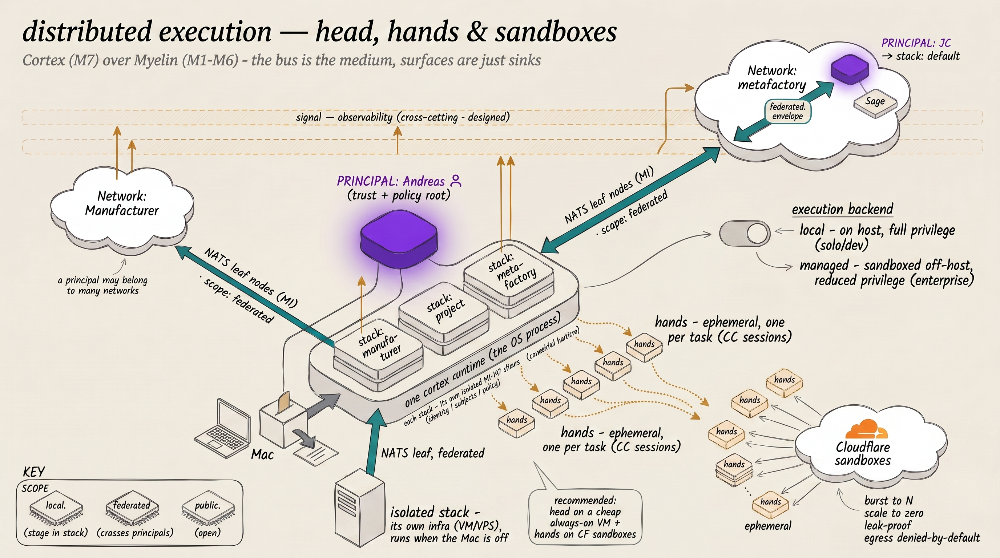

# Design — Distributed cortex stacks + managed execution (Spawn, reconsidered)

**Status:** direction / pre-ADR · **Date:** 2026-06-19 · **Supersedes premise of:** `docs/design-spawn-integration.md` (on ice, grove-era) · **Refs:** ADR-0013 (sovereign federation), ADR-0017 (surface bundles), the-metafactory/spawn (dormant since 2026-04)



*Extends the "one principal — many stacks — many networks" diagram with the head/hands/session split, the configurable `local` ↔ `managed` execution backend, off-host Cloudflare sandboxes for ephemeral hands, and a fully-isolated stack on its own VM.*

## 0. Why now

Two external products shipped since Spawn was designed, and they *are* what Spawn set out to build:

- **Anthropic Managed Agents** — a hosted service decomposing an agent into **Brain** (Claude + harness), **Hands** (sandboxes), **Session** (durable append-only log); Anthropic manages orchestration + session persistence + sandbox provisioning.
- **Cloudflare** provides the *hands*: code execution in lightweight V8 isolates **or** full microVMs (Cloudflare Containers — Linux, SSH), with credential-injecting egress proxies, Workers VPC / per-agent egress policies; deploy via fork-template → wrangler.

Spawn's own model was head/hands/session with "Claude Managed Agents as a fourth backend" (S-026). **So Spawn is superseded: integrate the shipped product, do not rebuild the engine.**

## 1. The frame: two orthogonal axes

A cortex *stack* today fuses three concerns onto one box (the principal's Mac):
- **head** — the daemon: bus presence, stack identity, surface adapters, orchestration.
- **hands** — the runner's CC sessions (local `Bun.spawn` today).
- **session** — Mission Control's event log.

The two needs sit on two independent axes:

| Axis | Question | Need |
|---|---|---|
| **Execution** (hands) | where does agent work run? | *"scale horizontally for a stack"* |
| **Hosting** (head) | where does the daemon live? | *"a completely isolated stack on its own infrastructure"* |

They compose; they are built differently.

## 2. Mode A — Elastic execution (scale the hands)

The stack stays where it is; the runner dispatches CC sessions to **Managed Agents / CF sandboxes** instead of local `Bun.spawn`. This is Spawn's `ManagedBackend`, now against a real API.

- **Buys:** elastic, isolated, off-machine *capacity* per task; ephemeral sandboxes; no Mac saturation under concurrency.
- **Build:** a runner execution backend that submits a task (brain=Claude, hands=CF sandbox) and bridges results back onto the bus. The runner's backend seam (`execution-backend`-style) is the integration point.
- **Sovereignty:** the existing per-task sovereignty/policy checks still gate WHAT runs; this only changes WHERE.

### 2.1 What "scale horizontally" actually looks like (head + hands)

The **head** is the persistent, identity-bearing orchestrator — the cortex daemon. It holds the stack's identity, bus presence, surface adapters (Discord), dispatch + conversation state, and the durable session log. It is long-lived, stateful, connection-holding, and it *decides* what work happens.

The **hands** are ephemeral, stateless execution units — one sandboxed Claude session per unit of work (review a PR, implement a slice, answer a newcomer). They carry no identity of their own; the head lends each one scoped tools + credentials for its single task, then it's torn down.

Scaling horizontally means the head stops running CC sessions as local `Bun.spawn` — bounded by one machine's CPU/RAM, and a blast-radius risk (a runaway task shares the host) — and instead **spawns each task as a fresh sandboxed hand on separate infrastructure** (Managed Agents / CF). Concretely:

- N concurrent tasks → N sandboxes, not N processes contending for one box. Burst wide for a big review sweep; scale to zero when idle.
- The head stays light — orchestration + connections only; the heavy inference/execution is elastic and off-machine.
- Each hand is isolated: a compromised or runaway task can't reach the head, the stack identity, the secrets, or sibling tasks — egress proxies + per-agent policy enforce the boundary.

This very project is the pattern in miniature: a head spawns parallel adversarial-review hands (correctness / security / behavior lenses), collects their verdicts, and drives the merge — today locally. Moving those hands onto elastic sandboxes is the same shape at scale, off the machine.

The vocabulary is deliberate and now industry-aligned: cortex's "persistent heads vs anonymous hands" = Anthropic's Brain / Hands / Session. The head is **sovereign and persistent** (Mode B — its own infra); the hands are **fungible and ephemeral** (Mode A — elastic sandboxes); the session is the **durable spine** that outlives any hand dying or the brain (model) being upgraded. The three can fail and be replaced independently — which is exactly why a head on a VM can keep spawning hands on CF while the model underneath improves.

### 2.2 Configurable execution backend (`local` | `sandboxed`) — the enterprise lever

WHERE a hand runs is a **per-stack config knob**, defaulting to local, selectable up to fully-sandboxed. The runner gets a pluggable `ExecutionBackend` seam (the dispatch path branches on it; the head/orchestration is unchanged):

| Backend | Where it runs | Privilege | Fit |
|---|---|---|---|
| `local` *(today)* | `Bun.spawn` on the host | **full host env**, constrained only by `allowedTools` / `allowedDirs` / bash-guard | solo / dev — lowest latency, zero infra |
| `subprocess-isolated` | host, via `@anthropic-ai/sandbox-runtime` (Spawn S-027) | reduced-privilege subprocess, no host env leakage | middle ground — isolation without going off-box |
| `managed` / `sandboxed` | CF sandbox / Managed Agents, off-host | **only the scoped tools + injected creds the head lends it**, egress-policed | **enterprise / regulated** |

Proposed config (per-agent, with a stack-level default):

```yaml
runtime:
  execution:
    backend: managed         # local | subprocess-isolated | managed
    # managed-only:
    sandbox: cloudflare      # provider
    egress: deny-by-default  # per-task allowlist the head injects
```

**Decoupled by construction.** The head depends only on the `ExecutionBackend` *interface* — `dispatch(task) → stream(effects/result)`. Concrete backends sit behind it and are injected by config; adding a substrate, or swapping CF for another sandbox provider, or an enterprise flipping the whole org to `managed`, never touches the head, the dispatch path, the agents, or the sovereignty checks. The selector is the *only* thing that knows which backend is live.

**The backend RELOCATES the harness — it never REPLACES it (load-bearing).** A real risk worth ruling out explicitly: do not let "managed" degrade into firing single-shot prompts at a thinner agent loop. Cortex already runs the *full* Claude Code harness headlessly — `claude --print --output-format stream-json --resume <sessionId> --allowedTools …` — which is the complete agent loop (tools, subagents, MCP, hooks), with `--resume` + the per-thread SessionManager giving multi-turn continuity and the *surface* supplying the human-in-the-loop turn. `--print` is not single-shot; it is Claude Code without the TUI. So `backend: managed` MUST mean **run that exact same `claude -p` hand inside a CF *Container* (full microVM)** — the container carries the full `claude` install; the egress proxy (§2.3) supplies `api.anthropic.com` + tool egress. Sandboxing changes *where* the harness runs, not *what* it is. Two thinner options — Anthropic Managed Agents' own *native* harness, or a lightweight V8 *isolate* that can't run full Claude Code — would trade the Claude Code harness for something lesser; they remain **separate, opt-in backends behind the same interface, never the default**. Full-harness hands → CF Containers, never isolates.

**Why this is the enterprise unlock.** With `backend: managed`, **no agent code ever runs with host privileges**. Every hand is a fresh isolated environment that holds only what the head hands it for one task — no host filesystem, no host env vars, no ambient credentials, egress denied-by-default. A prompt-injected or supply-chain-compromised task can't read the host, exfiltrate data, or touch the stack identity/secrets — the blast radius is one disposable sandbox with reduced privileges. That is precisely the de-risking a regulated buyer needs, and it's a **config flip**, not a re-architecture: the same head, the same dispatch, the same sovereignty checks gating WHAT runs — only WHERE and WITH-WHAT-PRIVILEGE the hand executes changes. Solo operators keep `local`; enterprises set `managed` org-wide.

### 2.3 Egress — sandboxed ≠ offline (the proxy *is* the feature)

"Egress denied-by-default" was imprecise and worth correcting: a useful agent must call APIs, search the web, hit GitHub, reach MCP servers. A sandboxed hand is **not cut off** — its outbound traffic runs through a **programmable zero-trust egress proxy** (Cloudflare Outbound Workers, GA Apr-2026) that makes internet access *safer* than raw host access, not absent:

- **Allowlist / denylist** — `allowedHosts` / `deniedHosts` (glob). Setting `allowedHosts` makes it a deny-by-default *allowlist*; the hand reaches the hosts its task needs and nothing else.
- **Credential injection (zero-trust)** — the hand makes a **plain** request; the proxy (running *outside* the sandbox) attaches the secret before forwarding. The agent authenticates to GitHub / an API **without ever holding the token** — so a prompt-injected or supply-chain-compromised hand can't exfiltrate creds it never had. *This is the headline win over `local`, where a CC session inherits host env vars.*
- **TLS interception** — a per-sandbox ephemeral CA lets the proxy inspect/filter HTTPS (the private key never leaves the sidecar).
- **Audit** — via Workers VPC + Cloudflare Gateway, every DNS/HTTP/network call is logged; you can *prove* what an agent reached.
- **Private services** — Cloudflare Mesh / Workers VPC reach internal APIs without exposing them to the public internet.
- **Dynamic** — `setOutboundHandler()` adjusts a running hand's policy per task, no restart.

**What cortex hands need egress for → per-capability egress profiles:**

| Need | Hosts | Who |
|---|---|---|
| the Claude brain | `api.anthropic.com` | **always** |
| code work | `github.com`, `*.githubusercontent.com`, `registry.npmjs.org` (token injected) | dev / review agents |
| web research | broad web via Gateway category-filter | research agents |
| MCP tools | the configured MCP endpoints | per agent |
| task API | the one endpoint the task needs | per task |

**Config (extends §2.2):**

```yaml
runtime:
  execution:
    backend: managed
    egress:
      profile: code              # code | research | narrow | custom — a per-capability preset
      allow: [api.anthropic.com, github.com, "*.githubusercontent.com"]
      credentials:               # held by the proxy, NEVER injected into the sandbox
        github.com: ${GITHUB_TOKEN}
```

**The reframed pitch:** the enterprise win is *not* "agents can't reach the internet." It's **"agents reach exactly what's allowed, with credentials they can never steal, every call audited"** — which is *more* useful and *more* secure than an agent on the host with raw env creds and unrestricted egress. Egress is a feature of the sandbox model, not a casualty of it.

### 2.4 Auth + billing — OAuth (subscription) vs API, and the scaling tension

A sharp real-world constraint, not a footnote. The goal is **Claude OAuth** (a Pro/Max subscription, `sk-ant-oat01-`), not per-token API. Three facts (researched 2026-06):

- **OAuth is ToS-restricted to *official Anthropic clients*** (Feb-2026): Claude Code CLI, claude.ai, Desktop, Cowork. Using the OAuth token from any *other* tool is a ToS violation → third-party integrations must use an API key. **Implication — and another reason harness-preservation (§2.2) is load-bearing: the OAuth path is only legitimate when cortex runs the *real* `claude` CLI, never a wrapper that reuses the token.** Cortex already invokes the official CLI, so `backend: managed` running `claude -p` in a Container is ToS-safe; extracting the OAuth token is not.
- **Headless/autonomous billing changed (June 15, 2026):** non-interactive `claude -p` / Agent-SDK usage on a subscription draws from a *separate, limited* monthly "Agent SDK credit" pool, then usage credits at standard API rates — NOT the unlimited interactive quota.
- **The subscription throttles parallelism** (the crux): two caps (a 5-hour rolling window + a 7-day roll; Max 5×/20×), and reportedly *"~10 parallel agents exhaust a weekly quota in hours; switch to API beyond 3–5 concurrent."*

**Honest position:** OAuth hands *work* — official `claude -p` in a CF Container is a permitted client — but **OAuth and *heavy* horizontal scaling conflict by design.** OAuth fits the head + a handful of hands (cost-sensitive, moderate concurrency); a wide fan-out (the very thing distributed execution enables) exhausts subscription caps and pushes you to API rates anyway. Anthropic deliberately routes autonomous/parallel work to API.

**Design — the `ExecutionBackend` is auth-mode-aware:**
```yaml
runtime:
  execution:
    backend: managed
    auth: oauth        # oauth (subscription, official CLI, low concurrency) | api (per-token, scales)
```
OAuth for low-volume / cost-sensitive; API for high fan-out. Provision OAuth creds into the Container via the egress credential-injection (§2.3) so the sandbox never holds the raw token. Do NOT adopt Managed Agents' *native* service for OAuth tasks — it is API/Agent-SDK-credit oriented (and a thinner harness, §2.2).

*(Billing here is evolving — the June-15 Agent-SDK-credit model + a reported `claude -p`-OAuth-bills-as-API issue mean: verify live billing before committing any scale plan.)*

## 3. Mode B — Isolated self-hosted stack (relocate the head)

The **entire daemon** runs on separate infrastructure — its own identity, bus participation, lifecycle, and management, independent of the Mac (Mac can be off).

- **Buys:** a genuinely sovereign peer stack; realistic federation testing without depending on a real external peer (e.g. JC); 24/7 stacks decoupled from the laptop; true multi-stack topologies with no single point.
- **Key insight:** Mode B does **not** require Managed Agents. It requires cortex to be a **portable, self-hosting, sovereign deployable unit** — which `arc install Cortex` + config-split layout + ADR-0013 sovereign federation already mostly deliver. Substrate is a choice:
  - **CF Container (microVM)** — elegant (egress/credential proxies, managed provisioning), but CF-coupled.
  - **VPS / fly.io / dedicated box** — full control, no coupling. Likely the better first target for a stack you "manage on its own infrastructure."
- **Does CF host the *head* too?** CF's "full VM" is **Cloudflare Containers** (Linux microVMs). They *can* run a stack daemon, but their model is on-demand / Worker-fronted / scale-to-zero — which suits ephemeral *hands* far better than an always-on, identity-bearing *head* holding persistent NATS-leaf + Discord-gateway connections (those connections never go idle, fighting scale-to-zero + the per-instance duration model). So CF answers Mode A cleanly; for an always-on isolated head, a classic VM/VPS is the natural host. **The elegant shape is the hybrid: head on a VM (Mode B) + hands on CF Managed Agents (Mode A)** — CF does elastic sandboxed execution; the sovereign daemon lives where always-on is cheap and simple. (Verify CF Containers' current always-on / duration limits before betting the head on them.)
- **What a Mode-B stack needs on its box:** Bun + (its own NATS or a leaf to a hub) + config-split dir + its own NKey seed / NSC operator + its bot tokens + its own `arc upgrade` / restart lifecycle.

## 4. The load-bearing decision: the hub must leave the Mac

Today the Mac almost certainly hosts the NATS hub. The instant a stack lives off-Mac **and must run when the Mac is off**, the hub has to leave the Mac too. Two shapes (ADR-0013 already frames this):

1. **Stable off-machine hub** — a small always-on box runs the hub; stacks (Mac + remote) leaf-connect to it. Simplest for a test zone.
2. **Fully sovereign per-stack operators** — each stack roots its own NSC operator and leaf-links peer-to-peer / to a network. The real sovereign model; more setup per stack.

This — not the compute substrate — is the architectural fork. Pick (1) for the first test zone; (2) is the production-sovereign end state.

## 4b. Hosting: sizing + pricing (researched 2026-06)

**Size by execution backend — this is the load-bearing sizing decision:**

- **Head only (`backend: managed`):** the cortex daemon is a light Bun process (bus client + adapters + orchestration), no local inference. **1–2 GB / 1 vCPU is plenty.** 2 GB is *not* slim here.
- **Head + `backend: local`:** Claude Code itself needs **~4 GB minimum**, ~8 GB comfortable for one-thing-at-a-time, **16 GB+** for parallel sub-agents — and it carries documented **memory-leak** behaviour (RSS ballooning to 8–13 GB+, pathologically 100 GB+, over 30–60 min sessions). On a small box, 2 GB is unworkable for local execution; size at 8–16 GB+ with session-restart hygiene.
- **Ephemeral sandboxed hands sidestep the leak entirely** — a hand runs one task and is torn down, so the long-session leak never accumulates. A further reason the hybrid (small always-on head + ephemeral CF hands) is the resilient shape, not just the cheap one.

**Always-on VM options for the head (lightweight, 1–2 GB):**

| Provider | ~Spec | ~Price/mo | Notes |
|---|---|---|---|
| **Hetzner** | CX23 (shared) → CPX22 2vCPU/4GB | ~€3.49 → €7.99 (Apr-2026) | best value; EU regions |
| **DigitalOcean** | 1 vCPU / 1 GB basic droplet | ~$4 | simple, global |
| **Fly.io** | shared-cpu-1x / 1 GB (256 MB ≈ $2) | ~$6.79 | per-second billing, easy deploy, scale-to-zero option |
| **CF Containers** | microVM | per-10ms-active CPU + provisioned mem | great for *hands*; awkward/pricey for an always-on *head* |

A 3-stack federation **test zone** ≈ **$12–30/mo** (Hetzner/Fly), or near-zero with Fly's scale-to-zero for non-always-on test stacks.

**Hands (Mode A) on CF:** active-only CPU billing (since Nov-2025) + scale-to-zero is exactly right for bursty per-task execution — you pay for execution, not idle. (CF's pricing is criticised as expensive for *always-on* workloads; that's the head's concern, never the ephemeral hands'.)

## 5. Spawn disposition

`the-metafactory/spawn` stays on ice. Its valuable thinking (head/hands/session, capacity gauge, dispatch UX) is now embodied by Managed Agents + this design. The forward work is **integration** (Mode A backend) + **portability/hosting** (Mode B), not reviving the engine. Close/relabel the grove-era Spawn issues accordingly.

## 6. Spikes (prove the direction before committing)

**Spike B1 (priority — the stated need): one isolated stack off the Mac.**
Stand up a single cortex stack on a remote box (start with a VPS/CF Container — whichever is faster), with its own identity, and **federate it with a local Mac stack**. Decide the hub shape (§4) as part of it. Outcome: the first off-machine federation test + proof cortex's daemon + leaf networking run cleanly off-Mac. This is also the foundation of the multi-stack federation **test zone** (N such stacks).

**Spike A1 (follow-on): ManagedBackend prototype.**
Wire the runner to dispatch one CC session to Managed Agents (brain=Claude, hands=CF sandbox) and bridge the result back onto the bus. Outcome: proof of elastic off-machine execution for a stack.

## 7. Open questions

- Secrets on remote infra (NKey seed, NSC operator, bot tokens) — provisioning + rotation off-Mac (CF vault/egress vs VPS secret store).
- How cortex's own Mission Control session/event log relates to Managed Agents' durable Session (dedupe, or MC consumes it?).
- CF Container vs VPS as the default Mode-B substrate (control vs convenience).
- Whether Mode-B stacks should default to sovereign-per-operator (§4.2) or shared-hub (§4.1) for the test zone vs production.
