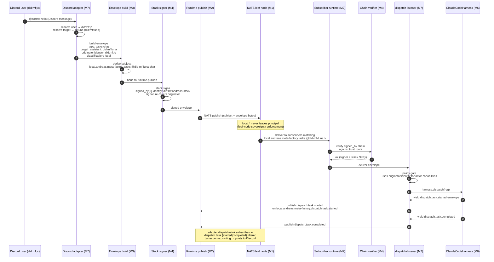
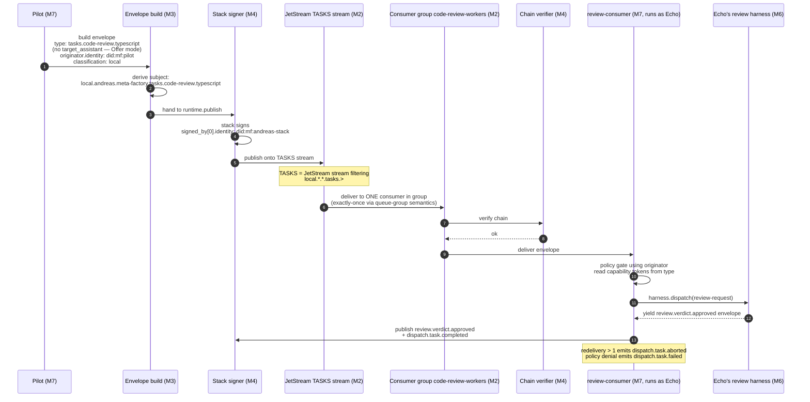
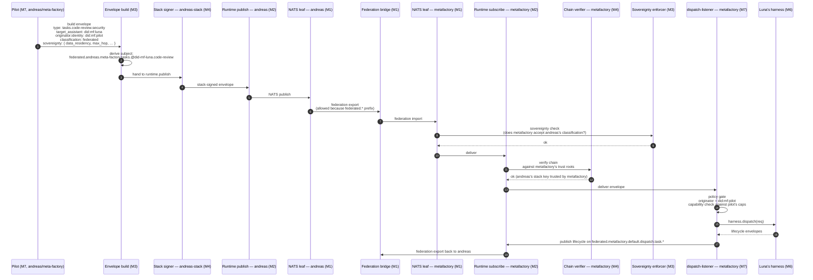
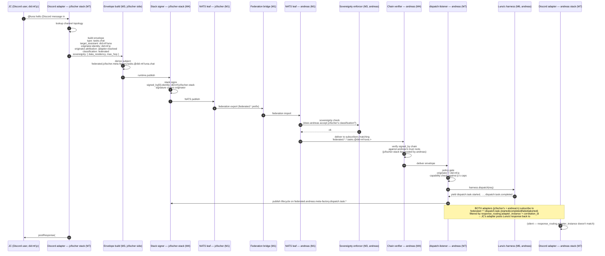
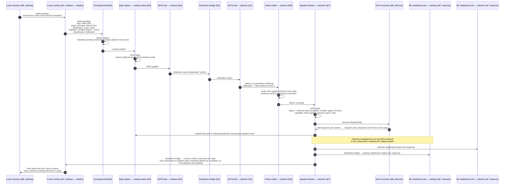

# Myelin OSI Layer Model — Dispatch Scenarios

**Status:** Pressure-test of the Direction A Q2 proposal against myelin's M1–M7 protocol stack. Surfaces four corrections to `docs/design-platform-adapter-dispatch-publishing.md`, adds Scenario 4 (cross-principal via shared platform surface) and Scenario 5 (bot-to-bot direct chat — the bus-native baseline). §12 has the locked answers for all four original §10 questions (Andreas, 2026-05-23 review); §14 captures the multi-subscriber / multi-surface pub-sub model.
**Date:** 2026-05-22 (Scenarios 1–3 + §1–§9); 2026-05-23 (Scenario 4, §11 locked answers)
**Driver:** Andreas (pushback in #myelin → §10/§11 locked answers) + Jens-Christian (Direction A grilling)
**Related:**
- `the-metafactory/myelin` — canonical M1–M7 layer model + namespace spec (`docs/architecture.md`, `specs/namespace.md`); `src/types.ts` ships `DistributionMode` + `AttributionMode` enums; `schemas/envelope.schema.json` carries the `originator` field
- `docs/design-platform-adapter-dispatch-publishing.md` — Direction A design (this doc supersedes Q2's grammar split; §12 supersedes Q1 signing model and the original §10 open questions)
- `docs/design-internet-of-agentic-work.md` + `docs/plan-internet-of-agentic-work.md` — **the IoAW architectural baseline** for cortex federation (cortex#110 META; cortex#117 Phase E: multi-network bridges + delegation). The OSI scenarios in this doc assume the federation primitives from IoAW §3.3 (`stack → network → multi-network`, NATS leaf-node federation, peer registry, accept-rules) — see §13 below for the open seams that tie Scenarios 3/4/5 to IoAW phases.
- `CONTEXT.md` — cortex vocabulary
- myelin#160 — Originator field (policy attribution vs crypto provenance; **closed** — shipped as envelope-level `originator: { principal, attribution }`)

---

## 1. Why this exists

The Direction A grilling (2026-05-22) proposed:

> **Q2:** cortex owns M7 dispatch subject grammar; myelin owns transport grammar.

Andreas pushed back via the OSI/myelin lens: *"underlying layers make sure the packet is delivered, cortex takes care of the application logic. Email has addressing AND sits at the application layer, right?"*

Email addresses (`mike@example.com`) **live in the application layer** but the **format is fixed by SMTP**. By analogy, dispatch subjects live in myelin's M3 envelope/namespace layer — cortex POPULATES the slots myelin defined; cortex does NOT own the grammar.

This doc redraws the split, then walks three concrete scenarios through the seven layers to pressure-test where each piece of work actually lands.

---

## 2. The stack (myelin canonical)

```
L7  SURFACES        cortex · pilot · signal-collector · dashboards
L6  COMPOSITION     Offer / Direct / Delegate dispatch patterns
L5  DISCOVERY       capability registry · agent manifests
L4  IDENTITY        signed_by chain · originator · trust roots
L3  ENVELOPE        schema · canonical form · sovereignty · NATS namespace
L2  TRANSPORT       myelin runtime: pub/sub · request/reply · JetStream
L1  CONNECTIVITY    NATS leaf nodes · federation links · TLS · TCP
```

Source: `~/work/mf/myelin/docs/architecture.md` §2.

---

## 3. Where work happens — corrected split

| Concern | Owning layer | Owner | What cortex contributes |
|---------|--------------|-------|--------------------------|
| Subject grammar (`{scope}.{principal}.{stack}.{domain}.{entity}.{action}`) | M3 | myelin (`specs/namespace.md`) | nothing — pure consumer |
| Tasks domain subgrammar (`tasks.@{assistant}.{capability}` for Direct/Delegate; `tasks.{capability}.{subcapability}` for Offer) | M3 | myelin (`namespace.md` §Tasks Domain) | nothing — pure consumer |
| DID-segment encoding (`:` → `-`, `.` → `--`) | M3 | myelin (`encodeDidSegment` helper) | nothing — uses helper |
| Envelope schema (envelope.json) | M3 | myelin (`schemas/envelope.schema.json`) | nothing — pure consumer |
| `signed_by` chain semantics (who-can-vouch-for-whom) | M4 | myelin | trust-resolver wiring |
| `originator.identity` (policy actor on the wire) | M3 + M4 | myelin (myelin#160) | adapter populates the field |
| Sovereignty rules (classification, residency, hops) | M3 | myelin | sets values per-envelope |
| Stack signing (NKey-per-stack at publish) | M4 | myelin (`runtime.publish`) | provides stack key |
| Capability tokens (`code-review.typescript`, `chat`, …) | M7 | cortex | full ownership |
| Dispatch mode choice (Offer / Direct / Delegate) for a given workload | M7 | cortex | full ownership |
| Persona / prompt / context bundle | M7 | cortex | full ownership |
| Response formatting back to the platform | M7 | cortex | full ownership |
| `dispatch.task.{action}` lifecycle envelopes (cortex-specific observability) | M7 (subjects use M3 grammar) | cortex | full ownership — chose the tokens |

**The split is sharper than the original Q2 said.** myelin owns the GRAMMAR at every layer M1–M6, including the Tasks-domain subgrammar with `@{assistant}` and `{capability}` segments. cortex owns the VALUES it populates and the SEMANTICS of the application-layer events (`dispatch.task.received`, the AgentTeam harness, persona injection).

---

## 4. Framing corrections to Direction A

Surfaced by this exercise. All three update `docs/design-platform-adapter-dispatch-publishing.md`: (4.1) the canonical wire grammar for Direct; (4.2) the conceptual framing that dispatch sources are pluggable and surfaces are not the medium; (4.3) the signing model (stack signs; adapter populates originator).

### 4.1 Subject grammar — Direct mode uses `tasks.@{assistant}.{capability}` not `dispatch.task.received`

The Direction A grilling pinned Direct-mode inbound as `dispatch.task.received` (because `dispatch-listener.ts` subscribes there today). Re-reading `specs/namespace.md` §Tasks Domain:

> **Direct / Delegate — named recipient**
> ```
> local.{principal}.{stack}.tasks.@{assistant}.{capability}
> ```
> The `@{assistant}` segment routes to a single assistant by DID — the segment is the DID-encoded form (per the encoding table), NOT a free-form display name.

This is the canonical wire grammar. `dispatch.task.received` is NOT a myelin-spec subject — it's a cortex-internal convention that predates the namespace finalisation. Direction A should publish onto `tasks.@{did-encoded-assistant}.chat` (or whichever capability), and `dispatch-listener` should grow a subscription on `tasks.>` to consume them.

`dispatch.task.{action}` survives as lifecycle observability (started/completed/failed/aborted) — that's still cortex-owned vocabulary at M7.

### 4.2 Dispatch source is pluggable — surfaces are not the medium

The original Direction A doc reads as if "platform adapter" is the canonical dispatch source. That is a framing error. **The bus is the medium; the platform surface (Discord, Mattermost, Slack, dashboard, PagerDuty) is a sink, optionally also a source.** A dispatch source is anything that publishes onto a `tasks.@{assistant}.{capability}` subject with a properly-signed envelope. Five concrete source classes:

| Source class | Originator field | Scope picker | Typical capability |
|---|---|---|---|
| Platform adapter (human→bot, e.g. Discord/Mattermost/Slack) | `principal = did:mf:<human-did>`, `attribution = "adapter-resolved"` | adapter chooses `local.` or `federated.` per channel topology | `chat`, plus typed workloads (`code-review`, …) |
| Another assistant's runtime (bot→bot autonomous) | **omitted** — signer IS the actor (myelin spec: peer-to-peer envelopes omit `originator`) | runtime picks scope from target principal: same → `local.`; different → `federated.` | `chat`, `code-review.*`, `release`, … any |
| Another assistant via delegation chain (bot→bot re-issued) | preserved from upstream envelope, `attribution = "delegated"` | follows target principal as above | any |
| MC dashboard "send task" action | adapter-resolved (the principal at the console) | dashboard's adapter picks | any |
| Tap / webhook (e.g. `gh-webhook` for GitHub events) | adapter-resolved (the platform identity bound to the tap) | tap's config | `code-review`, `release`, … |

**The `chat` capability is bus-native, not surface-bound.** An assistant declaring `chat` is saying "I accept free-form conversational dispatches"; it doesn't care which class of source originated the envelope. The signer is always the stack (per §4.3); originator + scope vary by source class.

`dispatch-handler.ts` (legacy) only addressed one path — adapter→handler in-process — and conflated medium with surface. Direction A makes the bus-native path canonical for ALL source classes.

---

### 4.3 Signing — stack signs; adapter populates `originator.identity`

The Direction A grilling pinned Q1a as *"adapter signs envelopes as the hosted agent (uses agent's nkey)"*. Per myelin#160 and Andreas's 2026-05-22 channel post, this is **the wrong model**. The canonical chain is:

1. Discord user → adapter resolves to principal id `did:mf:jc`
2. Adapter constructs envelope with `originator.identity = did:mf:jc`, `originator.attribution = "adapter-resolved"`
3. `runtime.publish` stack-signs the envelope (`signed_by[0].identity = did:mf:andreas-stack`, covers originator)
4. Receive-side runner verifies signature against stack NKey, reads `originator.identity` for policy lookup
5. Cryptographic signer (stack) + policy actor (user) cleanly separated — both attestable

Cortex Q1a updates: **stack signs; adapter populates `originator`**. The adapter does NOT hold an agent's NKey — it holds knowledge of the principal/agent identity to fill into `originator`.

---

## 5. Scenario 1 — Human-originated Direct via platform adapter (Discord example)

**One source class of many** (see §4.3). A Discord user mentions Luna in #cortex; the Discord adapter is the dispatch source. Same shape applies to Mattermost/Slack/MC dashboard adapters when a human originates. Luna runs as an assistant on the same stack (`andreas/meta-factory`).



**Layer summary for Scenario 1:**

| Step | Layer | Concern |
|------|-------|---------|
| 1–2 | M7 | Adapter resolves user + target — application semantics |
| 3–4 | M3 | Envelope + subject built per myelin grammar (Direct → `tasks.@{assistant}.{capability}`) |
| 5–6 | M4 | Stack signs; originator covered by signature |
| 7–8 | M2 / M1 | NATS routes; `local.` prefix never crosses principal |
| 9–10 | M4 | Receive-side chain verification |
| 11 | M7 | Policy decision using originator |
| 12 | M6 | Substrate harness executes |
| 13–14 | M7 | Lifecycle envelopes — cortex application vocabulary |

---

## 6. Scenario 2 — Pilot publishes Offer for code-review (capability routing)

Pilot decides a PR needs review. Doesn't address a specific assistant — publishes an Offer. Any agent whose assistant declares `code-review.typescript` and is in the consumer group claims it.



**Layer summary for Scenario 2:**

| Step | Layer | Concern |
|------|-------|---------|
| 1–2 | M3 | Offer mode subject — `tasks.{capability}.{subcapability}`, no `@{assistant}` segment |
| 3–4 | M4 | Stack signs |
| 5–6 | M2 | JetStream TASKS retains; consumer group claims (M2 owns competing-consumer semantics) |
| 7–8 | M4 | Receive-side chain verify |
| 9–10 | M7 | Cortex-specific review pipeline (review.verdict.* domain — cortex M7 application vocabulary) |
| 11 | M7 | Lifecycle envelopes — cortex application vocabulary |

**Key observation:** Offer-mode routing is **M2** (JetStream + consumer group). The subject filter (`local.*.*.tasks.code-review.>`) is M3 vocabulary, but the CLAIMING semantics — exactly-once across a competing-consumer group — is a M2 transport guarantee.

---

## 7. Scenario 3 — Cross-principal Direct (federated)

Pilot on `andreas/meta-factory` wants to delegate to Luna who runs under principal `metafactory` (different principal). Federation crosses principal boundaries.



**Layer summary for Scenario 3:**

| Step | Layer | Concern |
|------|-------|---------|
| 1–2 | M3 | `federated.` prefix; classification: federated; sovereignty block populated |
| 3–4 | M4 | Stack signs |
| 5–7 | M1 | Federation bridge — connectivity-layer routing across principal boundary |
| 8 | M3 | Receive-side sovereignty enforcement — myelin rule, not cortex |
| 9–10 | M4 | Chain verify against the recipient's trust roots (cross-principal trust = different roots) |
| 11 | M7 | Policy gate — recipient principal decides if the originator's capabilities apply here |
| 12 | M6 | Harness execution |
| 13–14 | M7 / M1 | Lifecycle envelopes federate back to originator's principal |

**Key observation:** Sovereignty (M3) and federation (M1) are the two layers that change behavior in cross-principal traffic. Everything else (M2 transport, M4 identity, M6 composition, M7 application) reads the same as Scenario 1 with the prefix swapped. The OSI discipline does its job — application logic doesn't change with the prefix.

---

## 8. Scenario 4 — Cross-principal via shared platform surface (Discord example)

**This scenario covers the legacy bridging pattern that Direction A retires.** Scenario 3 above covers _explicit_ cross-principal Direct dispatch (a bot on andreas explicitly addresses a bot on metafactory). What Direction A's original grilling missed was the pre-Direction-A reality: **shared platform channels (Discord) were the de-facto federation bridge for multi-principal collaboration**. Scenario 5 below covers the canonical post-Direction-A pattern (bot-to-bot direct on the bus, no surface in the middle).

### 8.1 The problem

Today (pre-Direction-A), Andreas and Jens-Christian collaborate in shared Discord channels. Each runs their own cortex stack (`andreas/meta-factory`, `jcfischer/meta-factory` — two principals, two stacks). Both of their adapter instances subscribe to the same Discord channel. Discord IS the federation bridge — the platform smuggles cross-principal traffic across as an application-layer side-channel.

Direction A removes the smuggling: adapters become **dispatch sources** publishing onto the bus. But `local.{principal}.{stack}.…` by definition NEVER leaves the principal. So under Direction A, when JC posts `@luna hello` in a shared channel:

- Andreas's adapter publishes `local.andreas.meta-factory.tasks.@did-mf-luna.chat` — invisible to JC's stack
- JC's adapter publishes `local.jcfischer.meta-factory.tasks.@did-mf-luna.chat` — invisible to Andreas's stack

If `@luna` is hosted on Andreas's stack only, JC's bot can't reach her. The bus is two separate islands. The OSI lens makes this obvious: `local.` is per-deployment, like a private subnet. Cross-principal traffic MUST be `federated.` to route at all — that's the L3-routing equivalent ("the MAC addresses aren't on the same network").

### 8.2 Three candidate models

| Model | Where federation lives | Trade-off |
|-------|------------------------|-----------|
| **A. Surface-as-federation (status quo carried forward)** | Discord stays the bridge. Each adapter publishes `local.…` for its own stack only. Cross-principal collaboration happens on Discord, never on the bus. | Zero new infra. Direction A's premise (bus owns dispatch routing) is partly negated — the bus doesn't replace Discord-as-bridge for the common case. |
| **B. Federation by default for multi-principal channels (RECOMMENDED)** | Adapter knows channel topology. For any channel that includes peer-principal assistants, the adapter publishes on `federated.{principal}.{stack}.tasks.@{assistant}.{capability}` instead of `local.…`. Trust roots span. NATS leaf-nodes federate. | The bus genuinely owns dispatch routing. Requires (i) NATS leaf-node federation between participating principals (M1), (ii) cross-principal trust roots (M4), (iii) channel-topology config in the adapter (M7), (iv) per-channel scope decision logic in the adapter (M7). |
| **C. Asymmetric host** | One principal "owns" the shared channel adapter; other principals' bots subscribe via `federated.…` to that adapter's published tasks. | Asymmetric, conflicts with peer-collaboration model. Wrong for the JC↔Andreas case where both contribute bots. |

### 8.3 Recommended model B — federation by default



### 8.4 Layer summary for Scenario 4 (model B)

| Step | Layer | Concern |
|------|-------|---------|
| 1 | M7 (platform) | User posts in shared Discord channel |
| 2 | M7 (adapter) | **Channel-topology lookup is the key new step.** Adapter knows which channels span principals and chooses `federated.` accordingly. |
| 3–4 | M3 | Envelope built with `federated.` classification; sovereignty populated |
| 5–6 | M4 | jcfischer stack signs; `originator.identity = did:mf:jc, attribution = adapter-resolved` |
| 7–9 | M1 | Federation bridge routes across principal boundary (the actual L3 hop) |
| 10 | M3 | Receiving principal enforces sovereignty rules |
| 11–12 | M4 | Cross-principal chain verify (different trust roots than intra-principal) |
| 13 | M7 | Policy gate on receiving principal — does JC's identity have capabilities here? |
| 14 | M6 | Luna's harness executes on andreas's stack |
| 15–16 | M7 / M1 | Lifecycle envelopes federate back to originator's principal |
| 17 | M7 (sink) | Each principal's dispatch sinks subscribe to `federated.*.*.dispatch.task.*` and filter by `response_routing.adapter_instance` to deliver back to the originating surface |

### 8.5 Implications

- **Federation is the norm, not the exception, for multi-principal collaboration.** Every chat involving a peer-principal assistant must publish `federated.` from the start. The current Direction A design defaults to `local.` — incomplete.
- **Channel-topology config is a new M7 concern.** The adapter must know which channels include peer-principal assistants. Two viable shapes: (i) explicit `cortex.yaml` per-channel config; (ii) Discord guild/role lookup that resolves to a peer-principal mapping. Open seam — see §10 below.
- **Trust roots must span.** Andreas's verify path must trust JC's stack key (and vice versa) — `TrustResolver` configuration that follows the network membership graph. The mechanism already exists for Scenario 3; Scenario 4 just exercises it as a hot path.
- **NATS leaf-node federation is a prerequisite.** Pre-condition for model B: the leaf nodes for participating principals are actually federated (config-level NATS work, not cortex work). If federation isn't configured between two principals, Direction A Stage 4 falls back to model A for that pair (Discord stays the bridge for them).
- **Stage 4 in Direction A migration sequence needs both modes.** Default model A (preserve today's behavior); enable model B per-channel once federation is configured for the relevant principal pair. Sub-issue #409 (Stage 4) is updated accordingly.

### 8.6 Why model B over model A

Model A (Discord-as-federation) is the safe v0 — zero new infrastructure. But it contradicts Direction A's stated premise: that the bus owns dispatch routing and platforms are reduced to UI surfaces. Under model A, the surface is still smuggling traffic the bus refuses to carry, which means cortex's federation guarantees (sovereignty, attestable trust chains, cross-principal policy enforcement) don't apply to the most common cross-principal flow.

The OSI discipline makes this stark: **`local.` is L2 (one broadcast domain); `federated.` is L3 (cross-network routing).** Pretending peer-to-peer traffic is L2 because it shares an L7 channel (Discord) is exactly the layering violation the OSI exercise was meant to surface.

Model B is the only model that delivers what Direction A claims. Model A is the fallback for principal pairs whose federation isn't configured yet — explicit "this is incomplete" not a permanent design.

---

## 9. Scenario 5 — Bot-to-bot direct chat (bus-native, no surface)

**The canonical case for post-Direction-A multi-assistant collaboration.** No platform adapter. No Discord. One assistant decides to start a conversation with another assistant; its runtime publishes onto the bus directly; the target assistant's harness processes it; lifecycle envelopes flow back to whichever sinks happen to be subscribed (a dashboard, a logger, possibly the originating runtime, possibly nothing at all).

This is what §4.3 calls "another assistant's runtime" as a dispatch source. The bus does not require a surface to be involved.

### 9.1 The setup

Luna runs on `andreas/meta-factory`. She's working on a PR and decides she wants Echo's read on the security boundary. Echo runs on `jcfischer/meta-factory` (different principal). Luna's runtime initiates a chat dispatch to Echo. No human in the loop; no Discord channel; the only surface that renders anything is the Mission Control dashboard on each principal, which subscribes broadly to lifecycle envelopes.

### 9.2 The flow



### 9.3 Layer summary for Scenario 5

| Step | Layer | Concern |
|------|-------|---------|
| 1 | M7 | Luna's harness decides to initiate — application-layer choice |
| 2–3 | M3 | Envelope built with `federated.` classification; **`originator` omitted** because Luna's stack IS the policy actor (peer-to-peer rule per myelin spec) |
| 4 | M2 | Publish onto NATS |
| 5 | M4 | Stack signs |
| 6–8 | M1 | Federation bridge — cross-principal routing |
| 9–10 | M4 | Cross-principal chain verify |
| 11 | M7 | Policy gate — recipient principal decides whether andreas-stack's caps apply here |
| 12 | M6 | Echo's harness executes |
| 13–14 | M7 / M1 | Lifecycle envelopes federate back; pub/sub fans out to N subscribers |
| 15 | M7 (sink) | Originating runtime consumes the reply via `correlation_id` filter |

### 9.4 What's NOT in this flow

- **No platform adapter.** No Discord adapter publishes; no Discord adapter subscribes.
- **No `originator` field.** Luna's stack is the actor; the spec omits originator when signer = actor.
- **No special bot-to-bot wire form.** Same subject (`tasks.@{assistant}.chat`); same envelope schema; same chain verify. The runtime is just another dispatch source class (§4.3).

### 9.5 Why this is the architectural baseline

Direction A's original framing reads as "platform adapter → bus → listener → harness". That's a real path (Scenario 1) but it's the *humans entering the bus* path. **The bus's existence is justified by Scenario 5** — bots talking to bots, surfaces optional. If the only thing the bus ever did was forward Discord messages to harnesses, you wouldn't need a bus; you'd just call functions in-process (which is exactly what legacy `dispatch-handler.ts` does).

The `chat` capability is the assistant's bus-native interface for free-form conversation. Adapters bridge humans onto it. Bots use it directly. Same wire grammar in both cases.

---

## 10. Restated Q2

| Question | Old answer (incorrect) | New answer |
|----------|-------------------------|------------|
| Q2 | Cortex owns M7 dispatch subject grammar; myelin owns transport grammar | **Myelin owns the grammar at every layer M1–M6 — including the Tasks-domain subgrammar (`tasks.@{assistant}.{capability}` and `tasks.{capability}.{subcapability}`). Cortex owns the VALUES it populates (capability tokens, dispatch mode choice per workload, persona) and the SEMANTICS of cortex-specific application events (`dispatch.task.{action}` lifecycle envelopes). Mirrors email: SMTP defines `localpart@domain` format; the user writes `mike@example.com`.** |
| Q1 | Adapter signs as hosted agent (uses agent's nkey) | **Stack signs the envelope via `runtime.publish` (using stack NKey). Adapter populates `originator.identity` with the resolved human/agent DID and `originator.attribution = "adapter-resolved"`. Stack key is the cryptographic provenance; originator is the policy actor. Both attestable; both inside the signature.** |

---

## 11. Implications for Direction A

The migration sequence in `docs/design-platform-adapter-dispatch-publishing.md` §7 needs updates:

- **Stage 2 (myelin alignment)**: no longer a question — myelin's spec is the answer. The "confirm with myelin team" task becomes "implement against the existing myelin spec".
- **Stage 3 (EnvelopePublishingAdapterBase)**: builds envelopes with `tasks.@{did-encoded-assistant}.{capability}` subjects, uses `encodeDidSegment` helper from `@the-metafactory/myelin/subjects`, populates `originator.identity` from `resolveAccess` output, hands to `runtime.publish` for stack-signing.
- **Stage 4 (Discord adapter)**: publishes onto `local.{principal}.{stack}.tasks.@{did-encoded-assistant}.chat` (capability = `chat` for free-form messages; reuse `code-review` etc. for explicit workloads). Adapter does not hold any agent NKey.
- **Stage 5 (Discord dispatch-sink)**: subscribes to `local.{principal}.{stack}.dispatch.task.{started|completed|failed|aborted}` filtered by `response_routing` (still the right pattern — these are cortex lifecycle subjects, M7-owned vocabulary).
- **dispatch-listener (Stages 1–7)**: must grow a subscription on `local.{principal}.{stack}.tasks.>` to consume adapter-originated Direct dispatches. The current `dispatch.task.received` subscription is non-canonical and should be removed.

Subject grammar in CONTEXT.md needs the same correction — the table in the Dispatch entry should read:

| Mode | Inbound subject |
|------|-----------------|
| Offer | `tasks.{capability}.{subcapability}` |
| Direct (intra-stack) | `tasks.@{did-encoded-assistant}.{capability}` (was: `dispatch.task.received`) |
| Direct (peer-to-peer / federated) | `federated.…tasks.@{did-encoded-assistant}.{capability}` |
| Delegate | `tasks.@{did-encoded-assistant}.{capability}` (mode encoded in payload, not subject — myelin spec doesn't separate Direct/Delegate at the wire) |

Lifecycle subjects (`dispatch.task.{action}`) are unchanged — those are cortex M7 vocabulary.

---

## 12. Locked answers to the four original §10 questions (Andreas, 2026-05-23)

The original §10 raised four open questions. Three were already settled in shipped myelin code; the fourth is a cortex-side decision. All four are locked here so Direction A can move past Stage 0.

### Q1 — Cortex's existing `dispatch.task.received` subscription
**Verdict: LEGACY.** Treated as pre-spec. The listener's `dispatch.task.received` subscription was canonical pre-namespace-finalisation; the canonical wire grammar (per `myelin/specs/namespace.md` §Tasks Domain) is `tasks.@{did-encoded-assistant}.{capability}` for Direct. Tests under `src/__tests__/iaw-phase-d-integration.test.ts` and `src/__tests__/cortex.test.ts` are load-bearing on the legacy subject and must be updated as part of Stage 7. **Path forward (Stage 7):** add `tasks.>` subscription alongside the legacy one for one release; flip adapter-side publishing to canonical subjects (Stages 4–6); remove the legacy subscription + update the IAW Phase D tests; release notes flag the wire-grammar change.

### Q2 — Capability token for free-form chat
**Verdict: ADD `chat`.** Free-form Discord/Mattermost/Slack `@assistant <message>` interactions publish on `tasks.@{did-encoded-assistant}.chat`. `chat` becomes a first-class capability in myelin's seed taxonomy (alongside `code-review`, `security-scan`, `deploy`, `release`). Cortex (the metafactory team _is_ the myelin team) lands the taxonomy extension as part of the next myelin release — not an external blocker.

### Q3 — `originator.attribution` enum values
**Verdict: ALREADY SHIPPED.** `myelin/src/types.ts:28` already declares:
```ts
export type AttributionMode = 'adapter-resolved' | 'federated' | 'delegated';
```
And `myelin/src/envelope.ts:50` enforces the closed set at validation:
```ts
const ATTRIBUTION_MODES = new Set(['adapter-resolved', 'federated', 'delegated']);
```
Direction A Stage 4 uses `adapter-resolved` for adapter-originated dispatches; Scenario 4 (federated-by-default) uses the same value (the originator is still resolved by an adapter — the federation is a transport concern, not an attribution concern). `federated` and `delegated` are the values that apply when re-issuing or forwarding envelopes; not in scope for Direction A v1.

### Q4 — Direct vs Delegate at the wire
**Verdict: ALREADY SHIPPED in `distribution_mode` field.** `myelin/src/types.ts:13`:
```ts
export type DistributionMode = 'broadcast' | 'direct' | 'delegate';
```
The mode bit lives in the envelope as a top-level `distribution_mode` field (NOT in the subject, NOT in the sovereignty block). The validator (`myelin/src/envelope.ts:210`) enforces `target_principal` required when `distribution_mode ∈ {direct, delegate}`. Direct and Delegate share subject shape (`tasks.@{assistant}.{capability}`); the listener routes to `AgentTeamHarness` for `delegate` after the subject + assistant-DID filter has already matched. One field read on the listener side; no payload introspection beyond what is already in place.

**Terminology note (cross-repo):** `DistributionMode` enum still ships `'broadcast'` as its first value. cortex `CONTEXT.md` (Flagged Ambiguities) explicitly canonicalised this concept to `Offer` and says "never call the Offer mode 'broadcast'". This is a pending myelin-side rename, filed separately. cortex code that consumes `distribution_mode` should map `'broadcast'` → cortex's `Offer` at the boundary until myelin renames.

---

## 13. Open seams (post-§12 resolution)

- **Channel-topology config for Scenario 4 model B.** Adapter needs to know which Discord/Mattermost/Slack channels span principals. Open seam — filed as a separate cortex issue. Until resolved, Stage 4 ships with model A default (preserve Discord-as-bridge for cross-principal channels) and a per-channel opt-in for model B.
- **NATS leaf-node federation preconditions — owned by IoAW Phase D/E (cortex#110, cortex#117).** Model B (and Scenario 5 cross-principal) require federated leaf nodes between principal pairs. This is NOT a design gap — `design-internet-of-agentic-work.md` §3.3 specifies the `stack → network → multi-network` composition; peer registry; accept-rules; the multi-`NatsLink` runtime extension. Direction A Stage 4 cutover for cross-principal traffic depends on IoAW Phase E being operationally available for the relevant principal pairs.
- **Connection establishment + discovery is wider than a per-pair leaf-node link.** Per Andreas (2026-05-23): "principals + bots can be members of many deployments and networks". The IoAW design covers single-network and multi-network bridging; capability discovery (myelin#9 — L5) is acknowledged-open. Direction A doesn't introduce new requirements here — it consumes the IoAW federation primitives wherever they land.
- **myelin `DistributionMode` rename (`'broadcast'` → `'offer'`).** Filed as a myelin-side issue (proposed in the C-405 corrections batch). cortex wraps the legacy spelling at the boundary until then.
- **Originating-runtime self-subscription pattern for Scenario 5.** Luna initiates a chat to Echo and needs to consume Echo's reply (a `dispatch.task.completed` envelope with `correlation_id` matching her initial dispatch). The mechanism — subscribe-by-correlation_id vs subscribe-by-source-DID vs explicit `response_routing` populated with Luna's own address — is not yet codified. Filed as a follow-up.

---

## 14. Multi-subscriber / multi-surface delivery model

The OSI scenarios all draw a single sink consuming each lifecycle envelope. **In NATS this is incidental** — subject delivery is pub/sub by default. Every subscriber whose subject filter matches receives every envelope independently. This has direct consequences for cortex's surface model.

### 14.1 Routed vs observer subscribers

Two classes of dispatch sink, by intent:

| Class | Subject filter | Behaviour |
|---|---|---|
| **Routed sink** | `dispatch.task.{action}` filtered by `response_routing.adapter_instance` matching its own instance ID | Renders only the envelopes it originated. The Discord adapter that sourced a chat posts the reply back to the originating channel; other Discord adapter instances see the envelope but their filter doesn't match — they no-op. |
| **Observer sink** | broad subscription (e.g. `dispatch.task.completed` for everything; or `tasks.>` for everything; or scoped to a principal/stack) — no `response_routing` filter | Always reacts. Mission Control dashboard renders every dispatch on its principal. A logging tap captures everything. A PagerDuty sink only reacts to `dispatch.task.failed`. |

**The same lifecycle envelope can have N subscribers of both classes simultaneously.** A bot-originated chat (Scenario 5) reaches both the originating runtime (via routed-by-correlation_id subscription) AND both principals' dashboards (observer subscription) AND any tap that happens to be active. No fan-out is configured at the publisher — fan-out happens at NATS subject delivery.

### 14.2 Multi-surface primary delivery (deferred design seam)

A separate question — surfaced by Andreas during the C-405 review — is whether ONE dispatch should produce primary delivery to MULTIPLE surfaces. Example: a chat originates on Discord channel A, but the principal also wants the reply to render in Mattermost channel B (because the team uses Mattermost for archival and Discord for live chat). The bus already supports this via observer subscriptions, but observer mode is "always render"; what the principal wants is "for THIS dispatch, also primary-deliver to these other places".

Three viable mechanisms:

| Mechanism | How | Cost |
|---|---|---|
| **A. `response_routing` becomes a list of channel addresses** | Inbound envelope payload carries `response_routing: ChannelAddress[]`. Each routed sink subscribes to its instance-ID slot. | Schema change to `response_routing`. Adapter-side fan-out logic. |
| **B. Per-dispatch `mirror_to` field** | Originating dispatch source declares `mirror_to: [addr1, addr2]`. Sinks subscribe by mirror declaration. | New envelope field. Requires every source to know about mirrors. |
| **C. Observer sinks with subject-derived rendering rules** | Mirror configuration lives in the sink, not the envelope. Mattermost adapter is configured to render every `tasks.@luna.>` from `andreas/meta-factory` (regardless of source). | Configuration grows; cleaner separation of concerns. Risk of accidental over-rendering. |

**Recommendation: C for v1.** Don't change the envelope schema; let sinks self-subscribe with rendering rules. Revisit A or B if sink-side configuration proves too distributed to manage. Not blocking Direction A — every adapter today does single-primary-delivery just fine.

### 14.3 Implication for Stage 4 / Stage 5

Stage 4 (adapter publishes inbound) and Stage 5 (adapter subscribes to lifecycle) don't need to change to support the multi-subscriber model — NATS already provides fan-out. What WOULD change for multi-surface primary delivery is a future Stage 8+ that lands rendering rules on the sinks. Not in scope for the v1 cutover.
