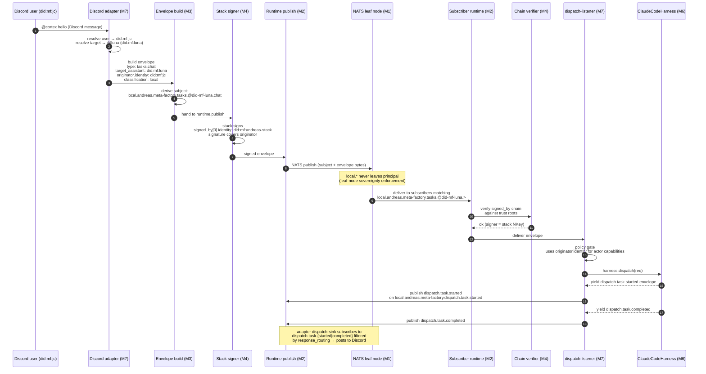
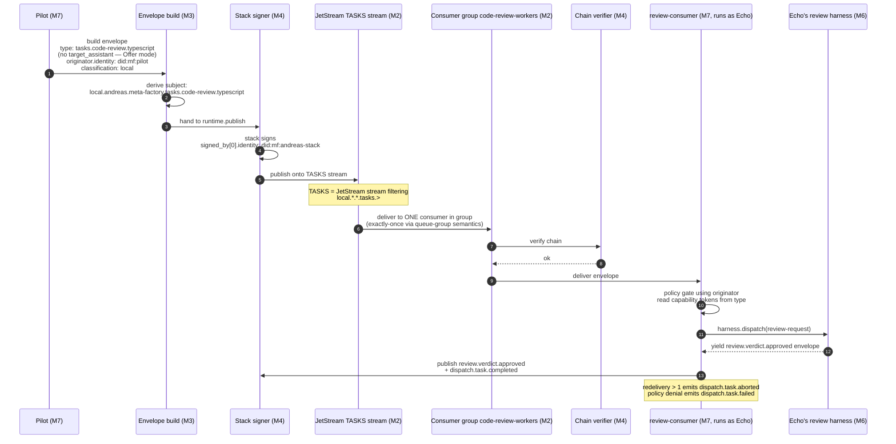
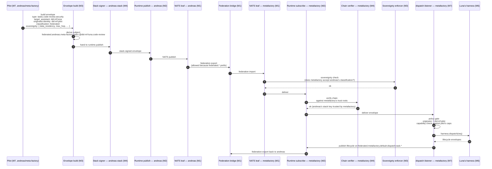

# Myelin OSI Layer Model — Dispatch Scenarios

**Status:** Pressure-test of the Direction A Q2 proposal against myelin's seven-layer protocol stack. Surfaces two corrections to `docs/design-platform-adapter-dispatch-publishing.md`.
**Date:** 2026-05-22
**Driver:** Andreas (pushback in #myelin) + Jens-Christian
**Related:**
- `~/work/mf/myelin/docs/architecture.md` — canonical seven-layer model
- `~/work/mf/myelin/specs/namespace.md` — subject grammar (Tasks Domain §, Originator §)
- `docs/design-platform-adapter-dispatch-publishing.md` — Direction A design (this doc supersedes Q2's grammar split)
- `CONTEXT.md` — cortex vocabulary
- myelin#160 — Originator field (policy attribution vs crypto provenance)

---

## 1. Why this exists

The Direction A grilling (2026-05-22) proposed:

> **Q2:** cortex owns M7 dispatch subject grammar; myelin owns transport grammar.

Andreas pushed back via the OSI/myelin lens: *"underlying layers make sure the packet is delivered, cortex takes care of the application logic. Email has addressing AND sits at the application layer, right?"*

Email addresses (`mike@example.com`) **live in the application layer** but the **format is fixed by SMTP**. By analogy, dispatch subjects live in myelin's M3 envelope/namespace layer — cortex POPULATES the slots myelin defined; cortex does NOT own the grammar.

This doc redraws the split, then walks three concrete scenarios through the seven layers to pressure-test where each piece of work actually lands.

---

## 2. The stack (myelin canonical)

```
L7  SURFACES        cortex · pilot · signal-collector · dashboards
L6  COMPOSITION     Offer / Direct / Delegate dispatch patterns
L5  DISCOVERY       capability registry · agent manifests
L4  IDENTITY        signed_by chain · originator · trust roots
L3  ENVELOPE        schema · canonical form · sovereignty · NATS namespace
L2  TRANSPORT       myelin runtime: pub/sub · request/reply · JetStream
L1  CONNECTIVITY    NATS leaf nodes · federation links · TLS · TCP
```

Source: `~/work/mf/myelin/docs/architecture.md` §2.

---

## 3. Where work happens — corrected split

| Concern | Owning layer | Owner | What cortex contributes |
|---------|--------------|-------|--------------------------|
| Subject grammar (`{scope}.{principal}.{stack}.{domain}.{entity}.{action}`) | M3 | myelin (`specs/namespace.md`) | nothing — pure consumer |
| Tasks domain subgrammar (`tasks.@{assistant}.{capability}` for Direct/Delegate; `tasks.{capability}.{subcapability}` for Offer) | M3 | myelin (`namespace.md` §Tasks Domain) | nothing — pure consumer |
| DID-segment encoding (`:` → `-`, `.` → `--`) | M3 | myelin (`encodeDidSegment` helper) | nothing — uses helper |
| Envelope schema (envelope.json) | M3 | myelin (`schemas/envelope.schema.json`) | nothing — pure consumer |
| `signed_by` chain semantics (who-can-vouch-for-whom) | M4 | myelin | trust-resolver wiring |
| `originator.identity` (policy actor on the wire) | M3 + M4 | myelin (myelin#160) | adapter populates the field |
| Sovereignty rules (classification, residency, hops) | M3 | myelin | sets values per-envelope |
| Stack signing (NKey-per-stack at publish) | M4 | myelin (`runtime.publish`) | provides stack key |
| Capability tokens (`code-review.typescript`, `chat`, …) | M7 | cortex | full ownership |
| Dispatch mode choice (Offer / Direct / Delegate) for a given workload | M7 | cortex | full ownership |
| Persona / prompt / context bundle | M7 | cortex | full ownership |
| Response formatting back to the platform | M7 | cortex | full ownership |
| `dispatch.task.{action}` lifecycle envelopes (cortex-specific observability) | M7 (subjects use M3 grammar) | cortex | full ownership — chose the tokens |

**The split is sharper than the original Q2 said.** myelin owns the GRAMMAR at every layer M1–M6, including the Tasks-domain subgrammar with `@{assistant}` and `{capability}` segments. cortex owns the VALUES it populates and the SEMANTICS of the application-layer events (`dispatch.task.received`, the AgentTeam harness, persona injection).

---

## 4. Two corrections to Direction A

Surfaced by this exercise. Both update `docs/design-platform-adapter-dispatch-publishing.md`.

### 4.1 Subject grammar — Direct mode uses `tasks.@{assistant}.{capability}` not `dispatch.task.received`

The Direction A grilling pinned Direct-mode inbound as `dispatch.task.received` (because `dispatch-listener.ts` subscribes there today). Re-reading `specs/namespace.md` §Tasks Domain:

> **Direct / Delegate — named recipient**
> ```
> local.{principal}.{stack}.tasks.@{assistant}.{capability}
> ```
> The `@{assistant}` segment routes to a single assistant by DID — the segment is the DID-encoded form (per the encoding table), NOT a free-form display name.

This is the canonical wire grammar. `dispatch.task.received` is NOT a myelin-spec subject — it's a cortex-internal convention that predates the namespace finalisation. Direction A should publish onto `tasks.@{did-encoded-assistant}.chat` (or whichever capability), and `dispatch-listener` should grow a subscription on `tasks.>` to consume them.

`dispatch.task.{action}` survives as lifecycle observability (started/completed/failed/aborted) — that's still cortex-owned vocabulary at M7.

### 4.2 Signing — stack signs; adapter populates `originator.identity`

The Direction A grilling pinned Q1a as *"adapter signs envelopes as the hosted agent (uses agent's nkey)"*. Per myelin#160 and Andreas's 2026-05-22 channel post, this is **the wrong model**. The canonical chain is:

1. Discord user → adapter resolves to principal id `did:mf:jc`
2. Adapter constructs envelope with `originator.identity = did:mf:jc`, `originator.attribution = "adapter-resolved"`
3. `runtime.publish` stack-signs the envelope (`signed_by[0].identity = did:mf:andreas-stack`, covers originator)
4. Receive-side runner verifies signature against stack NKey, reads `originator.identity` for policy lookup
5. Cryptographic signer (stack) + policy actor (user) cleanly separated — both attestable

Cortex Q1a updates: **stack signs; adapter populates `originator`**. The adapter does NOT hold an agent's NKey — it holds knowledge of the principal/agent identity to fill into `originator`.

---

## 5. Scenario 1 — Discord user → Luna (intra-stack Direct)

A Discord user mentions Luna in #cortex. Luna runs as an assistant on the same stack (`andreas/meta-factory`).



**Layer summary for Scenario 1:**

| Step | Layer | Concern |
|------|-------|---------|
| 1–2 | M7 | Adapter resolves user + target — application semantics |
| 3–4 | M3 | Envelope + subject built per myelin grammar (Direct → `tasks.@{assistant}.{capability}`) |
| 5–6 | M4 | Stack signs; originator covered by signature |
| 7–8 | M2 / M1 | NATS routes; `local.` prefix never crosses principal |
| 9–10 | M4 | Receive-side chain verification |
| 11 | M7 | Policy decision using originator |
| 12 | M6 | Substrate harness executes |
| 13–14 | M7 | Lifecycle envelopes — cortex application vocabulary |

---

## 6. Scenario 2 — Pilot publishes Offer for code-review (capability routing)

Pilot decides a PR needs review. Doesn't address a specific assistant — publishes an Offer. Any agent whose assistant declares `code-review.typescript` and is in the consumer group claims it.



**Layer summary for Scenario 2:**

| Step | Layer | Concern |
|------|-------|---------|
| 1–2 | M3 | Offer mode subject — `tasks.{capability}.{subcapability}`, no `@{assistant}` segment |
| 3–4 | M4 | Stack signs |
| 5–6 | M2 | JetStream TASKS retains; consumer group claims (M2 owns competing-consumer semantics) |
| 7–8 | M4 | Receive-side chain verify |
| 9–10 | M7 | Cortex-specific review pipeline (review.verdict.* domain — cortex M7 application vocabulary) |
| 11 | M7 | Lifecycle envelopes — cortex application vocabulary |

**Key observation:** Offer-mode routing is **M2** (JetStream + consumer group). The subject filter (`local.*.*.tasks.code-review.>`) is M3 vocabulary, but the CLAIMING semantics — exactly-once across a competing-consumer group — is a M2 transport guarantee.

---

## 7. Scenario 3 — Cross-principal Direct (federated)

Pilot on `andreas/meta-factory` wants to delegate to Luna who runs under principal `metafactory` (different principal). Federation crosses principal boundaries.



**Layer summary for Scenario 3:**

| Step | Layer | Concern |
|------|-------|---------|
| 1–2 | M3 | `federated.` prefix; classification: federated; sovereignty block populated |
| 3–4 | M4 | Stack signs |
| 5–7 | M1 | Federation bridge — connectivity-layer routing across principal boundary |
| 8 | M3 | Receive-side sovereignty enforcement — myelin rule, not cortex |
| 9–10 | M4 | Chain verify against the recipient's trust roots (cross-principal trust = different roots) |
| 11 | M7 | Policy gate — recipient principal decides if the originator's capabilities apply here |
| 12 | M6 | Harness execution |
| 13–14 | M7 / M1 | Lifecycle envelopes federate back to originator's principal |

**Key observation:** Sovereignty (M3) and federation (M1) are the two layers that change behavior in cross-principal traffic. Everything else (M2 transport, M4 identity, M6 composition, M7 application) reads the same as Scenario 1 with the prefix swapped. The OSI discipline does its job — application logic doesn't change with the prefix.

---

## 8. Restated Q2

| Question | Old answer (incorrect) | New answer |
|----------|-------------------------|------------|
| Q2 | Cortex owns M7 dispatch subject grammar; myelin owns transport grammar | **Myelin owns the grammar at every layer M1–M6 — including the Tasks-domain subgrammar (`tasks.@{assistant}.{capability}` and `tasks.{capability}.{subcapability}`). Cortex owns the VALUES it populates (capability tokens, dispatch mode choice per workload, persona) and the SEMANTICS of cortex-specific application events (`dispatch.task.{action}` lifecycle envelopes). Mirrors email: SMTP defines `localpart@domain` format; the user writes `mike@example.com`.** |
| Q1 | Adapter signs as hosted agent (uses agent's nkey) | **Stack signs the envelope via `runtime.publish` (using stack NKey). Adapter populates `originator.identity` with the resolved human/agent DID and `originator.attribution = "adapter-resolved"`. Stack key is the cryptographic provenance; originator is the policy actor. Both attestable; both inside the signature.** |

---

## 9. Implications for Direction A

The migration sequence in `docs/design-platform-adapter-dispatch-publishing.md` §7 needs updates:

- **Stage 2 (myelin alignment)**: no longer a question — myelin's spec is the answer. The "confirm with myelin team" task becomes "implement against the existing myelin spec".
- **Stage 3 (EnvelopePublishingAdapterBase)**: builds envelopes with `tasks.@{did-encoded-assistant}.{capability}` subjects, uses `encodeDidSegment` helper from `@the-metafactory/myelin/subjects`, populates `originator.identity` from `resolveAccess` output, hands to `runtime.publish` for stack-signing.
- **Stage 4 (Discord adapter)**: publishes onto `local.{principal}.{stack}.tasks.@{did-encoded-assistant}.chat` (capability = `chat` for free-form messages; reuse `code-review` etc. for explicit workloads). Adapter does not hold any agent NKey.
- **Stage 5 (Discord dispatch-sink)**: subscribes to `local.{principal}.{stack}.dispatch.task.{started|completed|failed|aborted}` filtered by `response_routing` (still the right pattern — these are cortex lifecycle subjects, M7-owned vocabulary).
- **dispatch-listener (Stages 1–7)**: must grow a subscription on `local.{principal}.{stack}.tasks.>` to consume adapter-originated Direct dispatches. The current `dispatch.task.received` subscription is non-canonical and should be removed.

Subject grammar in CONTEXT.md needs the same correction — the table in the Dispatch entry should read:

| Mode | Inbound subject |
|------|-----------------|
| Offer | `tasks.{capability}.{subcapability}` |
| Direct (intra-stack) | `tasks.@{did-encoded-assistant}.{capability}` (was: `dispatch.task.received`) |
| Direct (peer-to-peer / federated) | `federated.…tasks.@{did-encoded-assistant}.{capability}` |
| Delegate | `tasks.@{did-encoded-assistant}.{capability}` (mode encoded in payload, not subject — myelin spec doesn't separate Direct/Delegate at the wire) |

Lifecycle subjects (`dispatch.task.{action}`) are unchanged — those are cortex M7 vocabulary.

---

## 10. Open questions for Andreas / Luna

1. **Cortex's existing `dispatch.task.received` subscription** — is this legacy pre-spec, or is there a reason the listener subscribes there instead of `tasks.>`? Affects whether Stage 7 of Direction A also deletes the existing subscription.
2. **Capability token for free-form chat** — myelin's seed taxonomy lists `code-review`, `security-scan`, `deploy`, `release`. For a Discord `@cortex hello` message, we need a `chat` capability or a `conversation` capability. Cortex-side extension; check naming.
3. **`originator.attribution` enum** — myelin#160 mentions `"adapter-resolved"`. Are other values defined? (e.g. `"self"` for peer-to-peer, `"delegated"` for re-issued envelopes?)
4. **`Delegate` vs `Direct` at the wire** — namespace.md says they share the same subject shape; mode difference is principal-facing. Where does the mode bit live — payload or sovereignty block? Affects whether the listener can route to AgentTeamHarness via subject filter or must inspect payload.
