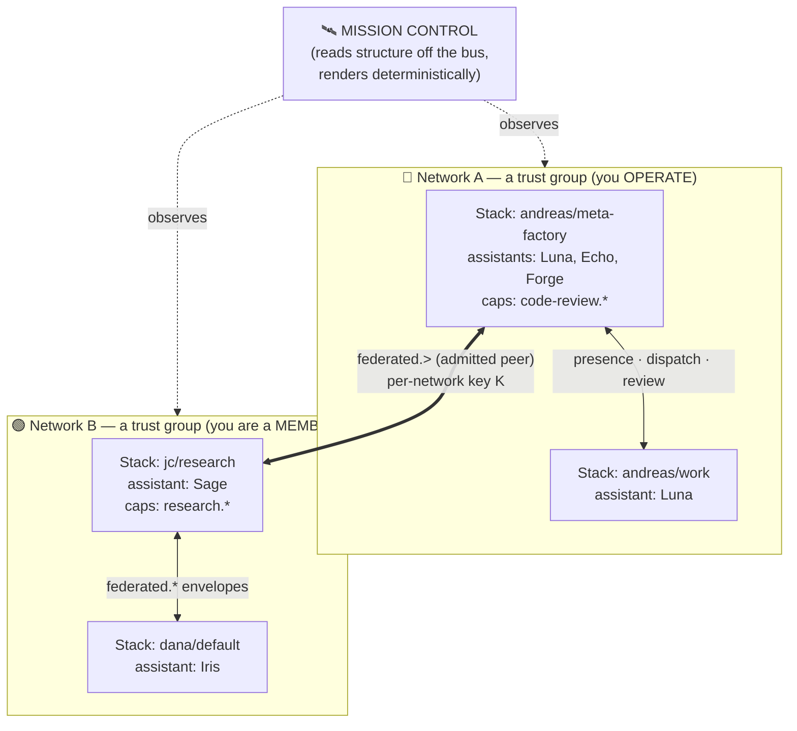
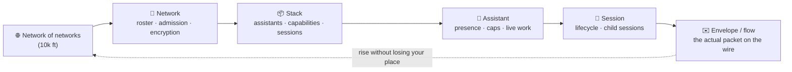

# Mission Control — the fly bridge of the Internet of Agentic Work

**Vision statement · the capstone surface of the metafactory stack (cortex · myelin · soma · spawn · signal)**
**Status:** vision (for design exploration) · 2026-06-28

---

## In one line

Mission Control is the single pane of glass from which a human **sees and steers** their entire world of working assistants — every stack, every assistant, every capability, every conversation on the bus, across every network they own or have joined. It is the surface where the whole metafactory stack becomes **legible and governable to a person**.

## The metaphor: a fly bridge, not a dashboard

A ship's **fly bridge** — or a **mission control room** — is not a wall of charts. It is the *commanding station*: the place with the best view and the real controls, where one person holds situational awareness over a system far too complex to keep in their head, and acts on it. The engines, the navigation, the life support — the genuine complexity — run *below*, hidden, doing their jobs. The bridge presents only what the commander needs to **understand** and to **decide**.

MC is that bridge for agentic work. Underneath it: NATS leaf federation, signed envelopes, sovereign NSC roots, admission gates, per-network encryption, dispatch consumers, session trees, OTel telemetry. **None of that belongs on the glass.** What belongs on the glass is: *who is working, on what, where, talking to whom, and is it healthy* — and the controls to change it.

## The Internet of Agentic Work

We built TCP/IP and got the Internet: a layered stack where hosts, routers, and autonomous systems interoperate without anyone holding the whole thing in their head — and "the network" became something you could **map**.

The Myelin layer model (M1–M7) is the same move for **agents**. It is the protocol stack of the **Internet of Agentic Work** — and MC is its map and its network-operations center. The correspondence is exact enough to design against:

| TCP/IP Internet | Internet of Agentic Work |
|---|---|
| Host | **Assistant** (a soma identity) |
| Machine / interface | **Stack** (a principal's deployment) |
| Autonomous System / trust domain | **Network** (a trust group — an admitted roster) |
| BGP / peering | **Registry + admission gate** (who's admitted, who peers) |
| Packet | **Envelope** (signed, on myelin) |
| Port / service | **Capability** (what an assistant offers) |
| Connection / flow | **Dispatch + session** (Offer / Direct / Delegate → work) |
| netflow / traceroute / the NOC | **Mission Control** |

MC is the topology view of this internet — except the nodes *think*, the edges carry *work*, and the "traffic" is *collaboration*.

## What MC makes legible — one glass over the whole stack

Each layer already produces truth; MC's job is to **compose** it, never re-derive it:

- **soma → *who*** — assistant identity, persona, the self that persists across substrates.
- **spawn → *the work*** — where execution actually runs: sessions, child sessions, the live doing.
- **myelin → *the conversation*** — the bus: presence, dispatch (Offer/Direct/Delegate), reviews, federation — the envelopes flowing between stacks.
- **signal → *the health*** — deep observability: transport liveness, intent⋈reality, the telemetry beneath the comms.
- **cortex → *the surface*** — MC itself: the composition, the altitude, the controls.

The discipline: MC **reads structure off the bus and renders it deterministically** — it never invents liveness. **Interiors stay sovereign**: an assistant's prompts, tools, and diffs never leave its stack; MC shows *that* work is happening and its lifecycle — the private inside only when it's *yours* (ADR-0005).

## Altitude: 10,000 feet, then dive

The view has one control above all others: **altitude**.

- **10k ft — the network of networks.** Every network you own or belong to, as trust-group constellations. Health, membership, and federation links at a glance.
- **Network.** One trust group: its admitted roster, who's present vs admitted-but-silent, its encryption posture, its hub.
- **Stack.** One deployment: the assistants on it, the capabilities they publish, its live sessions, its bus links.
- **Assistant.** One worker: presence (online / idle / offline), capabilities, what it's doing right now, its session tree.
- **Session.** The work itself: lifecycle (received → dispatched → running → done/failed), child sessions.
- **Envelope / flow.** The actual comms on the wire between two stacks — the "packet capture" of a single collaboration.

You should fall from the whole internet to a single envelope in a few moves, and rise back without losing your place.

## Two postures: the bridge you command vs the network you joined

The same glass, two fundamentally different stances — and MC must make obvious which one you're in, surfacing exactly the controls that stance grants and no more:

- **Admin of a network you own.** You hold the root, run the hub, own the admission gate. MC is your **control room**: the full roster, pending admission requests, grant/revoke, key rotation, the whole network's health and traffic. You **govern**. (Canonical posture term is **admin** — the design's "YOU OPERATE" label renamed; CONTEXT.md §"Network posture".)
- **Member of a network you joined.** You're a sovereign peer admitted to someone else's trust group. MC shows your slice + the peers you collaborate alongside, the capabilities on offer, the comms you're party to — but the admin controls aren't yours. You **participate**.

## Read *and* control

MC is both instrument and cockpit:

- **Read (situational awareness):** topology, presence, capabilities, live work, bus traffic, health — the truth, calmly.
- **Control (the control plane):** admit a member, dispatch work, request a review, revoke/rotate a key, switch a stack live — the actions, gated by your posture and step-up trust.

The control plane has lived in Discord, the data plane in GitHub. **MC is where they converge onto one glass** — where a human finally has a *steering wheel* for the Internet of Agentic Work, not just a feed.

## Why this is the capstone

Every other piece of the stack is plumbing that does its job invisibly. soma gives an assistant a self; spawn gives it somewhere to run; myelin gives them a shared language and a bus; signal watches it all. Each is, deliberately, complexity hidden under the waterline.

**MC is the waterline.** It is the one place the whole system surfaces to a human — where the Internet of Agentic Work stops being an abstraction in seven layers and becomes something you can **see, understand, and command** from a single commanding view. That is the capstone: not another component, but the surface that makes all the others worth having.

---

## Visual sketches (stubs for the design exploration)

These are *conceptual* starting points, not layouts — something for a designer to push against.

**The Internet of Agentic Work — topology MC renders:**

**Altitude — the primary gesture (10k ft → the envelope):**

## For the design exploration

**North stars**
- *Calm under complexity* — the 10k-ft view reads at a glance; depth is available, never imposed.
- *Altitude is the primary gesture* — zoom is the verb; everything is "where am I, and how deep."
- *Truth, never theater* — render structure off the bus; never fake liveness or synthesize data.
- *Posture-aware* — admin (govern) vs member (participate) are different cockpits on one glass.
- *Always reach the envelope* — you can always drill to the actual packet of a collaboration **on your own (local) stacks**; across the federation boundary, session/envelope granularity stays home and a peer shows **aggregated metadata at best**.
- *Sovereign by default* — interiors never leave their stack; the glass respects the trust boundary. Session-level visibility is local-only; federated visibility is aggregated (extends ADR-0005 up a level).

**Open questions for design**
- How does the **network of networks** read at 10k ft — constellation, geographic-style map, force graph, something new?
- How does an **altitude transition** feel — zoom, push-into, breadcrumb, lens?
- How is a **flow** (bus comms between two stacks) visualized — animated edges, a netflow strip, a live envelope log?
- How do **admin controls** appear for an owned network without cluttering the member view of a joined one?
- How does **health (signal)** overlay onto the topology without drowning it?
- What is the **"you are here"** anchor as you dive and surface across six altitudes?
- How does the eye distinguish **presence** (an assistant is up) from **activity** (it's doing work) from **traffic** (envelopes moving) from **health** (the link is sound)?
</content>
